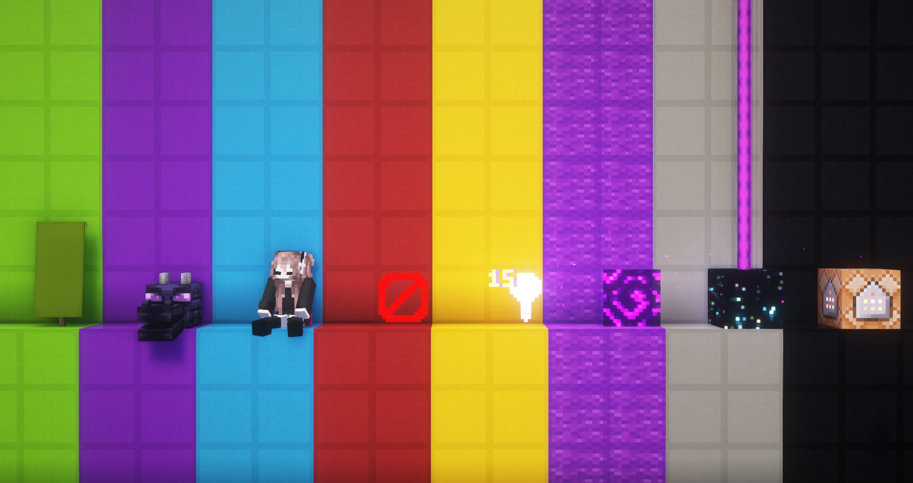

# 03加载票类型

## 3.1加载票类型

在Minecraft一共有8种加载票类型，在 `net.minecraft.server.world.ChunkTicketType`规定了

```java
    public static final ChunkTicketType<Unit> START = create("start", (a, b) -> 0);
    public static final ChunkTicketType<Unit> DRAGON = create("dragon", (a, b) -> 0);
    public static final ChunkTicketType<ChunkPos> PLAYER = create("player", Comparator.comparingLong(ChunkPos::toLong));
    public static final ChunkTicketType<ChunkPos> FORCED = create("forced", Comparator.comparingLong(ChunkPos::toLong));
    public static final ChunkTicketType<ChunkPos> LIGHT = create("light", Comparator.comparingLong(ChunkPos::toLong));
    public static final ChunkTicketType<BlockPos> PORTAL = create("portal", Vec3i::compareTo, 300);
    public static final ChunkTicketType<Integer> POST_TELEPORT = create("post_teleport", Integer::compareTo, 5);
    public static final ChunkTicketType<ChunkPos> UNKNOWN = create("unknown", Comparator.comparingLong(ChunkPos::toLong), 1);
```

## 3.2加载票类型对应的用处

游戏内与加载等级对应的是加载距离，算法是：

加载等级 = 33 - 加载距离 `net.minecraft.server.world.ChunkTicketManager#addTicket`

```java
    public <T> void addTicket(ChunkTicketType<T> type, ChunkPos pos, int radius, T argument) {
        ChunkTicket<T> chunkTicket = new ChunkTicket<>(type, ChunkLevels.getLevelFromType(ChunkLevelType.FULL) - radius, argument); 
        long l = pos.toLong();  //ChunkLevelType.FULL = 33
        this.addTicket(l, chunkTicket);
        this.simulationDistanceTracker.add(l, chunkTicket);
    }
```

* start，用于世界启动时加载出生点。加载距离是 11 。`net.minecraft.server.MinecraftServer#prepareStartRegion`
* dragon，用于进行龙战时。加载 9 距离。 `net.minecraft.entity.boss.dragon.EnderDragonFight#tick`
* player，玩家加载。
* forced，用于 `/forceload`指令与强加载出生点。
* light，用于光照计算。
* portal，用于生物或玩家穿过传送门时，300gt（15s）内没有使用过之后，移除与之相关的加载票，加载距离是 3 。`net.minecraft.world.PortalForcer#getPortalRect`
* post_teleport，用于生物或玩家进行传送时，比如 `/tp`，5gt后移除。
* unknown，用于游戏内代码上使用了 `getChunk`后加载区块，1gt后移除。

需要注意的是，加载距离并不由 `ChunkTicketType`指定，比如 `post_teleport` 在 `/tp` 指令使用时加载距离为 1，而其他情况下为 0。
