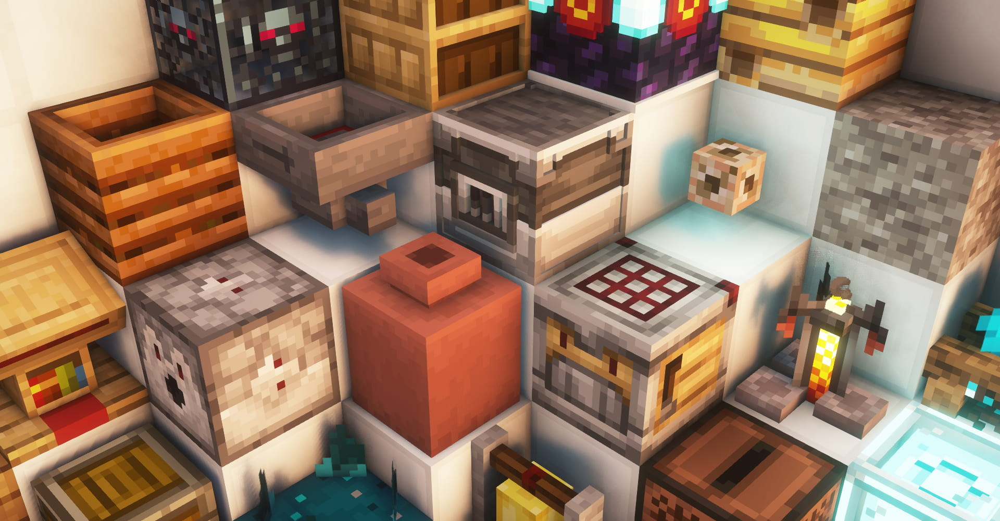
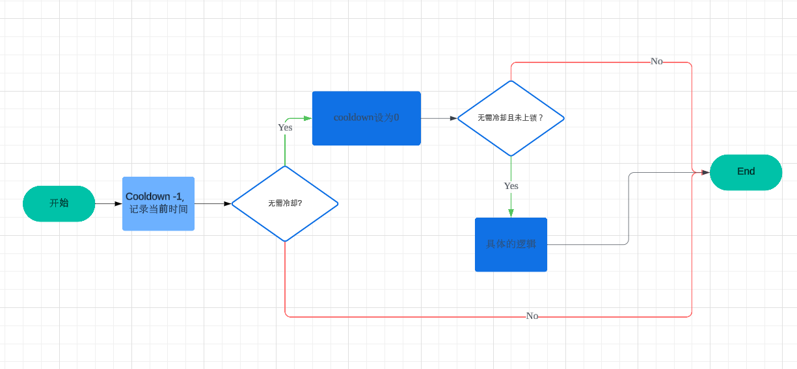
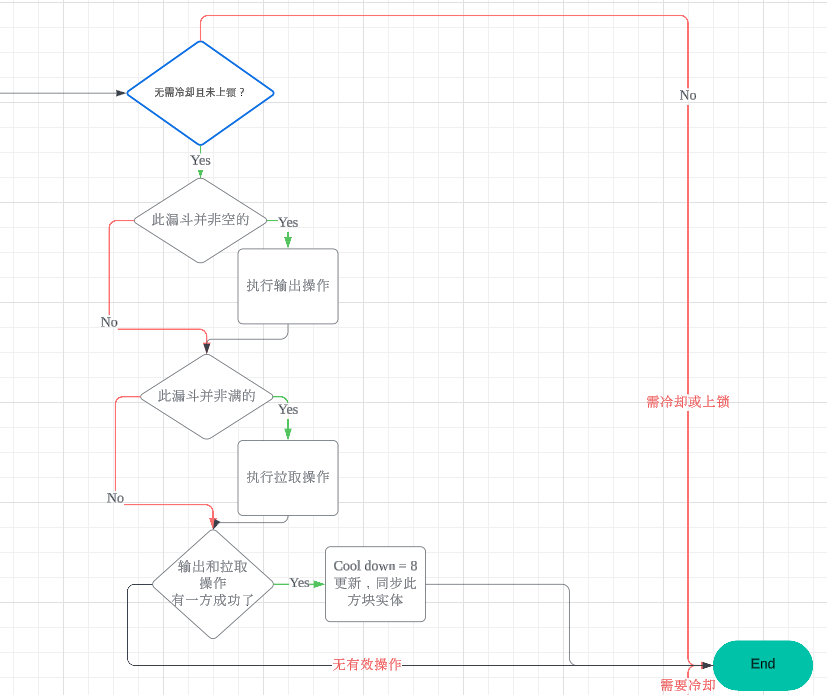

# #04 方块实体

## 5.1 方块实体的概念与内容

### 5.1.1 什么是方块实体？

方块本身通过预定义的有限 BlockState 集合保存数据；通过默认的方块渲染行为渲染模型；通过更新系统、计划系统等决定执行逻辑。
但是，这样的模式具有局限性, 无法直接满足在游戏交互中一些方块的功能。

因此，我们需要一种专门帮助特定方块存储数据，实时处理逻辑，进行额外渲染的组件。我们叫它们***方块实体***。
方块实体相为普通方块提供了三个重要的额外功能： ***使用NBT存储数据***、***自定义的渲染行为*** 和 ***在每一次tick中进行更新***。

方块实体通过NBT来存储数据，和实体一样。而且，与方块状态不同，
方块实体的数据不会自动同步到客户端: 方块实体必须自己声明何时同步以及同步哪些数据。

### 5.1.2 方块实体的内容

方块实体是因方块而异的，但一个抽象的，基本的方块实体含有以下基本信息与功能:

#### 携带的信息

- type 类型
- world 所在的世界
- pos 位置
- removed 是否已被移除
- cachedState 缓存的，对应方块的状态;

#### 提供的重要功能

- readNbt 读入NBT数据
- writeNbt 写出NBT数据
- tick 在服务器tick中执行逻辑
- render 进行自定义的渲染

### 5.1.3 带有方块实体的方块

方块实体与世界绑定，每个方块位置仅有一个方块实体实例。

| 方块                       | 用途                             |
|--------------------------|--------------------------------|
| 蜂箱（Beehive）              | 用于储存蜜蜂数量和其中的蜂蜜等级。              |
| 蜂巢（Bee Nest）             | 用于储存蜜蜂数量和其中的蜂蜜等级。              |
| 告示牌（Sign）                | 用于储存显示的文字。                     |
| 悬挂式告示牌（Hanging Sign）     | 用于储存显示的文字。                     |
| 旗帜（Banner）               | 用于储存显示的图案。                     |
| 箱子（Chest）                | 用于储存物品，支持战利品表信息。               |
| 陷阱箱（Trapped Chest）       | 用于储存物品，支持战利品表信息。               |
| 发射器（Dispenser）           | 用于储存物品，支持战利品表信息。               |
| 投掷器（Dropper）             | 用于储存物品，支持战利品表信息。               |
| 合成器（Crafter）             | 用于存储禁用哪些槽位，以及战利品表信息。           |
| 酿造台（Brewing Stand）       | 用于储存当前的酿造时间。                   |
| 漏斗（Hopper）               | 用于储存下一次传送物品的间隔时间。              |
| 熔炉（Furnace）              | 用于储存当前烧炼物的时间和燃料的剩余时间。          |
| 高炉（Blast Furnace）        | 用于储存当前烧炼物的时间和燃料的剩余时间。          |
| 烟熏炉（Smoker）              | 用于储存当前烧炼物的时间和燃料的剩余时间。          |
| 营火（Campfire）             | 用于储存和显示其状态。                    |
| 潜影盒（Shulker Box）         | 用于储存物品，支持战利品表信息。               |
| 木桶（Barrel）               | 用于储存物品，支持战利品表信息。               |
| 讲台（Lectern）              | 用于存储书当前所在的页面。                  |
| 雕纹书架（Chiseled Bookshelf） | 用于存储最近一次放入或取出的书的槽位号。           |
| 可疑的沙子（Suspicious Sand）   | 用于储存它容纳的物品。                    |
| 可疑的沙砾（Suspicious Gravel） | 用于储存它容纳的物品。                    |
| 信标（Beacon）               | 用于储存金字塔的层数、被激活的效果和容纳的物品。       |
| 刷怪笼（Spawner）             | 用于储存生成的实体类型、生成时间间隔、数量及附加值。     |
| 音符盒（Note Block）          | 用于保存它需要播放的音符。                  |
| 移动中的活塞（Piston Arm）       | 用于保存方块的移动状态和方向，以及被移动方块的ID和数据值。 |
| 唱片机（Jukebox）             | 用于播放所包含的音乐唱片。                  |
| 附魔台（Enchantment Table）   | 用于控制悬浮书的状态。                    |
| 末地传送门（End Portal）        | 用于局域性粒子效果显示。                   |
| 末影箱（Ender Chest）         | 用于局域性粒子效果显示。                   |
| 生物头颅（Mob Head）           | 用于储存头颅种类和朝向，以及所属玩家信息（如果存在）。    |
| 命令方块（Command Block）      | 用于储存命令方块种类、保存的命令、输出的信号强度和输出文字。 |
| 末地折跃门（End Gateway）       | 用于传送的位置和是否渲染光柱。                |
| 结构方块（Structure Block）    | 用于储存有关结构的信息。                   |
| 钟（Bell）                  | 用于渲染摇摆动画。                      |
| 潮涌核心（Conduit）            | 用于激活范围和状态渲染。                   |
| 幽匿催发体（Sculk Catalyst）    | 用于储存其蔓延信号。                     |
| 幽匿感测体（Sculk Sensor）      | 用于监听周围的振动游戏事件。                 |
| 幽匿尖啸体（Sculk Shrieker）    | 用于监听周围的振动游戏事件。                 |
| 磁石（Lodestone）            | 用于绑定磁石指针。                      |
| 黑板（Chalkboard）           | 用于储存显示的文字。                     |
| 化合物创建器（Compound Creator） | 用于储存实验物品和进程。                   |
| 饰纹陶罐（Decorated Pot）      | 用于存储陶片样式及容纳的物品。                |
| 宝库（Vault）                | 用于储存其配置数据、渲染数据等信息。             |

## 5.2 重要的带有方块实体的方块

### 5.2.1 漏斗

#### 漏斗方块实体携带的信息

一个可爱的漏斗方块实体携带一下基本信息:

- inventory 储存空间（5格）
- transferCooldown 冷却（默认为-1）
- lastTickTime 上一tick的世界时间
- facing 朝向

#### 漏斗方块实体的功能

- 输出
- 从容器中吸取物品
- 物品实体吸取的尝试
接下来，我们会用整理一张流程图来描述漏斗是如何进行这三个功能的。

所有漏斗在开始计算时会将自身cd(Cool down)减少1，随后，它会检查自己是否仍然需要冷却。

若无需冷却，它会尝试拉取和输出。

否则，它会结束运算。

现在，让我们移步到***尝试拉取和输出的具体的逻辑***

