# #05 方块事件

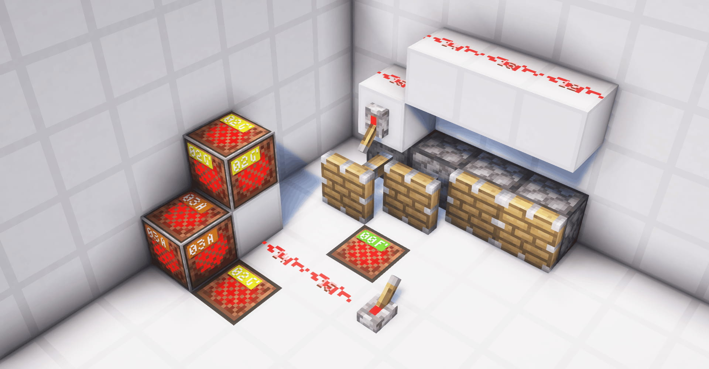

## 5.1 方块事件的概念与内容

> 五羊飞写的太棒了，本部分在很多方面借鉴了[五羊飞的文档](https://github.com/kaniol-lck/Minecraft-Note/tree/main/Piston)

### 5.1.1 什么是方块事件？

在游戏交互中，为了减少网络压力，一些数据较多，会大量出现，或者行为复杂的方块应当避免把所有的数据同步到客户端。
相反的，我们可以告诉客户端服务器发生了一些事件，并让客户端的方块把服务端发生的一些事情模拟一遍。
方块事件就是为此而生的。

### 5.1.2 方块事件的内容

一个**方块事件的信息结构**：包含以下内容

- 位置`pos`：在哪里发生
- 方块种类`block`：哪一方块种类执行这个计划刻
- 种类`type`：是哪种事件（有效于活塞，记录伸出和收回等）
- 数据`data`：执行时必要的数据（有效于活塞，记录推动的朝向）

### 5.1.3 方块事件元件

> 相当少的红石元件会产生方块事件，确切地说，只有2个 -- 活塞和音符盒[^1]

[^1]:实际上并不只有这俩，其他方块如钟等也会产生方块事件，但是由于其难以被观测或是难以利用，我们在此处不做讨论

| <center>元件种类</center> | <center>方块事件内容</center>        |
|----------------------|--------------------------------|
| 活塞                   | 坐标，活塞(粘性/普通)，（伸出，收回，瞬推收回），活塞朝向 |
| 音符盒                  | 坐标，音符盒，0，0                     |

## 5.2 活塞的组成

> 完整意义上的活塞有两部分组成，分别是活塞底座和活塞头。

活塞底座完全控制活塞头，并且活塞有两种状态，分别是`收回`和`伸出`。通常情况下，当活塞处于被激活状态时，其会同时更改其活塞底座为伸出状态，并出现活塞头。当活塞处于收回状态时，其活塞头也随之消失。但是，也有部分手段可以创造出只有伸出的活塞底座没有活塞头的**无头活塞**(更确切地说，并不是没有活塞头，而是将它的活塞头指向了某个其他方块)，我们稍后会详细了解这种特殊状态的活塞。在1.16以前，活塞头只会检查自己后方是否存在活塞底座，而不会在意其朝向，这给了制作“多头活塞”的机会。但是，在1.16后，活塞头不仅会检查身后活塞底座的存在性，还会检查其朝向，使得这种“多头活塞”不复存在。考虑到其在1.20.1的不可行性，我们在此处对其不做讨论。

## 5.3 活塞的自检

> 关于其它类型的自检，可以先查看[其它类型的自检](../BlockUpdate/01-更新概念与不同类型的更新.md#16-方块自检)

```java
//被玩家放置
    public void onPlaced(World world, BlockPos pos, BlockState state, LivingEntity placer, ItemStack itemStack) {
        if (!world.isClient) {
            this.tryMove(world, pos, state);
        }

    }
//被NC更新
    public void neighborUpdate(BlockState state, World world, BlockPos pos, Block sourceBlock, BlockPos sourcePos, boolean notify) {
        if (!world.isClient) {
            this.tryMove(world, pos, state);
        }

    }
//被其他东西放置
    public void onBlockAdded(BlockState state, World world, BlockPos pos, BlockState oldState, boolean notify) {
        if (!oldState.isOf(state.getBlock())) {
            if (!world.isClient && world.getBlockEntity(pos) == null) {
                this.tryMove(world, pos, state);
            }

        }
    }
```

活塞当且仅当以下两种情况发生时自检：

- 被放置[^2]
- 被更新
- 被玩家放置

[^2]:值得注意的是，这种放置包括被其它活塞放置。

同时，必须强调的是，活塞的自检是可以发生在任意阶段的，活塞会在任意阶段自检，并视情况决定其是否在方块事件阶段添加事件。

### 5.3.1 活塞对红石信号的检查

```java
private boolean shouldExtend(RedstoneView world, BlockPos pos, Direction pistonFace) {
    // 遍历所有方向（上、下、北、南、东、西）
    for (Direction direction : Direction.values()) {
        if (direction != pistonFace && world.isEmittingRedstonePower(pos.offset(direction), direction)) {
            return true;// 如果活塞所在的一格接受到红石信号，活塞应当伸展
        }
    }
    if (world.isEmittingRedstonePower(pos, Direction.DOWN)) {
        return true;  // 如果下方有红石信号，活塞应当伸展
    } else {
        // 如果下方没有红石信号，检查活塞上方的方块
        BlockPos blockPos = pos.up(); // 获取活塞上方的方块位置(这是为了QC冲能准备的)
        for (Direction direction2 : Direction.values()) {
            // 如果当前方向不是向下（活塞本体所在的位置），并且该方向的方块发出红石信号
            if (direction2 != Direction.DOWN && world.isEmittingRedstonePower(blockPos.offset(direction2), direction2)) {
                // 如果活塞上方的一格接受到红石信号，活塞应当伸展
                return true;
            }
        }
        // 如果没有任何方向的方块发出红石信号，活塞不应伸展
        return false;
    }
}
```

接下来我们将详细探讨活塞是如何判断其激活源的。其总是按照以下步骤执行：

1. 活塞检查自身毗邻的方块，不包括其朝向方块，是否发出红石信号，如果发出，则激活活塞
2. 如果直接毗邻活塞的方块没有一个正在发出红石信号，则检查其上方方块毗邻的方块，包括活塞自己，是否发出红石信号，如果发出，则激活活塞
3. 若以上条件都不满足，则不激活活塞

以上步骤揭示了为何活塞具有的重要性质之一，半连接性(Quasi-Connectivity)，简称QC，若不清楚可以返回[QC性质说明](../BlockUpdate/01-更新概念与不同类型的更新.md#132-nc更新的性质qc激活bud装置)查看。

### 5.3.2 活塞自检逻辑

```java
private void tryMove(World world, BlockPos pos, BlockState state) {
    // 获取活塞的朝向（通过状态中的FACING属性）
    Direction facing = (Direction)state.get(FACING);
    
    // 判断是否有红石信号
    boolean shouldExtend = this.shouldExtend(world, pos, facing);
    
    // 如果应该伸出且活塞当前没有伸出（EXTENDED属性为false）
    if (shouldExtend && !(Boolean)state.get(EXTENDED)) {
        // 创建一个PistonHandler对象来尝试推动方块
        // 如果成功推动，则添加一个方块事件
        if ((new PistonHandler(world, pos, facing, true)).calculatePush()) {
            world.addSyncedBlockEvent(pos, this, 0, facing.getId());
        }
    }
    // 如果不应该伸出且活塞当前处于伸出状态（EXTENDED属性为true）
    else if (!shouldExtend && (Boolean)state.get(EXTENDED)) {
        // 计算活塞头前方的位置（当前活塞位置向活塞推出朝向进行2个单位的偏移）
        BlockPos pistonHeadFront = pos.offset(facing, 2);
        
        // 获取目标位置的方块状态
        BlockState headFrontState = world.getBlockState(pistonHeadFront);
        
        // 初始化状态码（默认为1）
        // 状态码的代表状态：
        // 0：伸出
        // 1：收回
        // 2：瞬推收回
        int actionType = 1;
        
        
        if (headFrontState.isOf(Blocks.MOVING_PISTON) // 如果目标方块是一个正在移动的活塞
                && headFrontState.get(FACING) == facing //并且其朝向与当前活塞相同
                && world.getBlockEntity(pistonHeadFront) 
                        instanceof PistonBlockEntity pistonBlockEntity // 如果方块实体是移动的活塞（b36）
                && pistonBlockEntity.isExtending()// 如果目标b36正在伸出
                && (pistonBlockEntity.getProgress(0.0F) < 0.5F //如果伸出进度小于50%
                        || world.getTime() == pistonBlockEntity.getSavedWorldTime() 
                        || ((ServerWorld)world).isInBlockTick())
        ) {
            actionType = 2;// 应该瞬推收回
        }

        // 添加方块事件
        world.addSyncedBlockEvent(pos, this, actionType, facing.getId());
    }
}
```

> 值得注意的是，actionType=2时，活塞瞬推收回并不在乎这个b36是否是自己产生的。

现在再让我们看回到活塞自检，其总是按照如下步骤执行：

1. 如果活塞处于收回状态但实际上应该伸出，则添加活塞头，若成功伸出，则添加方块事件
2. 如果活塞处于伸出状态但没有红石信号支持，则考虑收回活塞
3. 若自己正在伸出且进度小于50%，则瞬推收回，添加方块事件
4. 否则正常收回，添加方块事件

## 5.4 b36转化顺序

### 5.4.1 可推动方块

```java
public static boolean isMovable(BlockState targetState, World world, BlockPos pos, Direction direction, boolean canBreak, Direction pistonDir) {
    // 判断方块位置是否在有效的世界区域内
    // pos.getY() >= world.getBottomY() 且 pos.getY() <= world.getTopY() - 1 确保方块在世界的有效Y轴范围内
    // world.getWorldBorder().contains(pos) 确保方块位置在世界边界内
    if (pos.getY() >= world.getBottomY() && pos.getY() <= world.getTopY() - 1 && world.getWorldBorder().contains(pos)) {
        
        // 如果方块是空气，活塞可以推动空气
        if (targetState.isAir()) {
            return true;
        }
        
        // 如果方块是不可推动的特殊方块（如黑曜石、哭泣的黑曜石、重生锚、强化深板岩等）
        else if (!targetState.isOf(Blocks.OBSIDIAN) 
                && !targetState.isOf(Blocks.CRYING_OBSIDIAN) 
                && !targetState.isOf(Blocks.RESPAWN_ANCHOR) 
                && !targetState.isOf(Blocks.REINFORCED_DEEPSLATE)
        ) {
            
            // 如果是向下推动且方块处于世界的最低Y值，则不能推动
            if (direction == Direction.DOWN && pos.getY() == world.getBottomY()) {
                return false;
            }
            // 如果是向上推动且方块处于世界的最高Y值，则不能推动
            else if (direction == Direction.UP && pos.getY() == world.getTopY() - 1) {
                return false;
            } 
            else {
                // 如果方块不是活塞或粘性活塞
                if (!targetState.isOf(Blocks.PISTON) && !targetState.isOf(Blocks.STICKY_PISTON)) {
                    // 如果方块的硬度为-1.0F，表示它是无法破坏的（如某些特殊方块）
                    if (targetState.getHardness(world, pos) == -1.0F) {
                        return false;
                    }

                    // 根据方块的活塞行为来决定是否可以推动
                    switch (targetState.getPistonBehavior()) {
                        case BLOCK:
                            // 如果活塞行为是BLOCK，表示方块无法被推动
                            return false;
                        case DESTROY:
                            // 如果活塞行为是DESTROY，表示方块可以被破坏，取决于canBreak参数
                            return canBreak;
                        case PUSH_ONLY:
                            // 如果活塞行为是PUSH_ONLY，只有在推动方向与活塞方向一致时才可以推动
                            return direction == pistonDir;
                    }
                } 
                // 如果方块是活塞本身并且是扩展状态，则不能推动
                else if ((Boolean)targetState.get(EXTENDED)) {
                    return false;
                }

                // 检查方块是否有方块实体，如果有方块实体，不能被推动
                return !targetState.hasBlockEntity();
            }
        } else {
            // 如果方块是特殊的不可推动的方块（如黑曜石等），直接返回false
            return false;
        }
    } else {
        // 如果方块位置超出有效世界范围或在世界边界之外，返回false
        return false;
    }
}

```

当活塞判断是否可以推动方块时，总是会做以下判断：

1. 如果活塞的推动在世界边界外，其推动方块会被推到世界边界外，或大于游戏高度上限或小于游戏高度下限，则不会推出。
2. 如果活塞尝试推动的方块是空气，则可以推出
3. 若活塞尝试推动黑曜石，哭泣黑曜石，重生锚，或强化深板岩，则拒绝推出
4. 若活塞尝试推动的方块是硬度为-1的方块（如末地传送门，基岩，屏障等），则拒绝推出
5. 若活塞尝试推动的方块拥有Block活塞行为的属性，则拒绝推出
6. 若活塞尝试推动的方块拥有DESTROY活塞行为属性，则视情况破坏该方块
7. 若活塞尝试推动的方块拥有PUSH_ONLY活塞行为的属性，则只有在活塞推动的方向和活塞方向一致时才能被推动
8. 若活塞尝试推动的方块具有方块实体(如箱子，漏斗等)，则拒绝推出

### [进阶]5.4.2 移动结构分析

> 温馨提示，这部分是本章节最为复杂的一部分之一，如果比较懒可以直接使用pistOrder模组而并不需要真正学习本部分在说的内容

```java
public boolean calculatePush() {
    // 清空已移动的方块和已破坏的方块列表，以便重新计算
    this.movedBlocks.clear();
    this.brokenBlocks.clear();

    // 获取活塞将要推动的起始点
    BlockState pistonHeadFrontState = this.world.getBlockState(this.posTo);

    // 如果起始点不能推动
    if (!PistonBlock.isMovable(pistonHeadFrontState, this.world, this.posTo, this.motionDirection, false, this.pistonDirection)) {
        // 如果方块不可推动且当前处于缩回状态，并且方块行为为DESTROY，则将其标记为破坏
        if (this.retracted && pistonHeadFrontState.getPistonBehavior() == PistonBehavior.DESTROY) {
            this.brokenBlocks.add(this.posTo); // 添加到破坏列表
            return true; // 活塞仍然可以进行操作（通过破坏方块）
        } else {
            return false; // 活塞无法推动且无法破坏目标方块
        }
    }
    // 如果目标方块可推动，但无法添加直线结构，无法推动
    else if (!this.tryMove(this.posTo, this.motionDirection)) {
        return false;
    } 
    else {
        // 遍历所有被标记为需要移动的方块
        for (int i = 0; i < this.movedBlocks.size(); ++i) {
            BlockPos posToValidate = (BlockPos) this.movedBlocks.get(i);
            
            // 如果当前方块是粘性方块，尝试移动它周围的粘连方块
            if (isBlockSticky(this.world.getBlockState(posToValidate)) && !this.tryMoveAdjacentBlock(posToValidate)) {
                return false; // 如果移动周围粘连方块失败，则整体推动失败
            }
        }

        return true; // 所有方块都成功移动或处理
    }
}

```

当活塞需要推动时，会先执行以上代码，这段代码是用于分析移动结构的。这里需要更多更为详细的表述以辅助各位读者理解：`movedBlocks`和`brokenBlocks`实际是两个`arrayList`。没有了解过`Java`语言的读者可以简单理解为一个可以随意插入，取出的列表。这段代码本质在按照以下顺序执行操作：

1. 清空`movedBlocks`和`brokenBlocks`两个列表。
2. 检查其起始位置是否可以推动
   - 如果不可推动，则检查其对活塞行为的响应
     - 如果可破坏，则将该方块添加至`brokenBlocks`列表，推动成功
     - 如果不可破坏，则推动失败
   - 如果可推动，则尝试添加其直线结构（我们稍后会解析活塞是如何分析直线结构的）
     - 如果无法添加其直线结构，则推动失败
     - 如果成功添加其直线结构，则遍历所有需要推动的方块
       - 如果存在粘性方块（粘液块和蜂蜜块），则尝试添加分支
         - 若添加失败，则推动失败
     - 如果以上均没有失败，则推动成功

Mojang在这里通过两个方法实现了对直线结构的分析和对分支结构的分析。分别称为`tryMove`[^3]和`tryMoveAdjacentBlock`。

[^3]:这里的`tryMove`是需要消歧义的，在`Java`中，两个在不同类的方法是可以被赋予相同名字。这里的`tryMove`是在`PistonHandler.java`里的

### [进阶]5.4.3 直线结构分析

```java
private boolean tryMove(BlockPos posToValidate, Direction dir) {
    // 获取指定方块
    BlockState stateToValidate = this.world.getBlockState(posToValidate);

    // 如果方块是空气方块，直接返回true，因为不需要处理空气
    if (stateToValidate.isAir()) {
        return true;
    } 
    // 如果方块不可移动，根据当前条件直接返回true
    else if (!PistonBlock.isMovable(stateToValidate, this.world, posToValidate, this.motionDirection, false, dir)) {
        return true;
    } 
    // 如果方块位置是活塞的初始位置，直接返回true
    else if (posToValidate.equals(this.posFrom)) {
        return true;
    } 
    // 如果方块已经在已移动列表中，直接返回true，避免重复计算
    else if (this.movedBlocks.contains(posToValidate)) {
        return true;
    } 
    else {
        int rearBlockCount = 1; // 计数器初始化为1

        // 检查当前方块是否是黏性方块，并尝试追踪其连接的其他方块
        if (rearBlockCount + this.movedBlocks.size() > 12) {
            // 如果移动的方块总数超过12个，返回false
            return false;
        } else {
            while (isBlockSticky(stateToValidate)) {
                // 获取黏性方块在相反方向上的下一个方块
                BlockPos blockBehind = posToValidate.rearBlockCount(this.motionDirection.getOpposite(), rearBlockCount);
                BlockState currentStateSaved = stateToValidate; // 当前方块状态
                stateToValidate = this.world.getBlockState(blockBehind); // 下一个方块状态

                // 如果下一个方块是空气、不粘连、不可移动或是活塞初始位置，结束循环
                if (stateToValidate.isAir() 
                    || !isAdjacentBlockStuck(currentStateSaved, stateToValidate) 
                    || !PistonBlock.isMovable(stateToValidate, this.world, blockBehind, this.motionDirection, false, this.motionDirection.getOpposite()) 
                    || blockBehind.equals(this.posFrom)) {
                    break;
                }

                ++rearBlockCount; // 增加偏移距离
                if (rearBlockCount + this.movedBlocks.size() > 12) {
                    // 如果移动的方块总数超过12个，返回false
                    return false;
                }
            }

            int succeededCount = 0; // 用于记录成功移动的方块数量

            // 将所有黏性方块及其连接方块添加到移动列表
            for (int k = rearBlockCount - 1; k >= 0; --k) {
                this.movedBlocks.add(posToValidate.offset(this.motionDirection.getOpposite(), k));
                ++succeededCount;
            }

            int frontBlockCount = 1; // 计数器初始化为1

            // 开始处理推动方向上的方块
            while (true) {
                BlockPos blockFront = posToValidate.offset(this.motionDirection, frontBlockCount); // 下一个方块的位置
                int l = this.movedBlocks.indexOf(blockFront); // 检查方块是否已在移动列表中

                if (l > -1) {
                    // 如果方块已经在移动列表中，调整移动列表的顺序
                    this.setMovedBlocks(succeededCount, l);

                    // 遍历调整后的列表，检查所有黏性方块并处理其连接方块
                    for (int m = 0; m <= l + succeededCount; ++m) {
                        BlockPos stuckBlock = (BlockPos) this.movedBlocks.get(m);
                        if (isBlockSticky(this.world.getBlockState(stuckBlock)) && !this.tryMoveAdjacentBlock(stuckBlock)) {
                            return false;
                        }
                    }

                    return true; // 所有相关方块处理成功
                }

                // 获取当前偏移位置的方块状态
                stateToValidate = this.world.getBlockState(blockFront);

                // 如果当前方块是空气，推动成功
                if (stateToValidate.isAir()) {
                    return true;
                }

                // 如果当前方块不可移动或是活塞的初始位置，返回false
                if (!PistonBlock.isMovable(stateToValidate, this.world, blockFront, this.motionDirection, true, this.motionDirection) 
                    || blockFront.equals(this.posFrom)) {
                    return false;
                }

                // 如果当前方块是可破坏的，将其添加到破坏列表
                if (stateToValidate.getPistonBehavior() == PistonBehavior.DESTROY) {
                    this.brokenBlocks.add(blockFront);
                    return true;
                }

                // 如果移动列表已达到12个方块，返回false
                if (this.movedBlocks.size() >= 12) {
                    return false;
                }

                // 将当前方块添加到移动列表
                this.movedBlocks.add(blockFront);
                ++succeededCount; // 增加移动计数
                ++frontBlockCount; // 增加偏移量
            }
        }
    }
}
```

首先先明确这个方法会在何种情况下被调用：

1. 这个方块直接被方块推动
2. 这个方块直接被粘性方块带动

值得注意的是，这两种方法是严格互相独立的，这意味着这两种情况之间不会有任何重复。

当因第一种情况被调用时，这个方块本身一定不是一个不可推动的方块，详情可以回看上文5.4.2部分。当因为第二种情况调用时，这个方块本身如果是一个不可推动的方块，考虑到尝试带动它的方块是一个粘性方块，则没有必要考虑对其进行分析。(实际上也就是下图中的这种情况)

在进行了以上分析后，我们就可以正式的看看本方法的第一部分代码。

```java
BlockState stateToValidate = this.world.getBlockState(posToValidate);

    // 如果方块是空气方块，直接返回true，因为不需要处理空气
    if (stateToValidate.isAir()) {
        return true;
    } 
    // 如果方块不可移动，根据当前条件直接返回true
    else if (!PistonBlock.isMovable(stateToValidate, this.world, posToValidate, this.motionDirection, false, dir)) {
        return true;
    } 
    // 如果方块位置是活塞的初始位置，直接返回true
    else if (posToValidate.equals(this.posFrom)) {
        return true;
    } 
    // 如果方块已经在已移动列表中，直接返回true，避免重复计算
    else if (this.movedBlocks.contains(posToValidate)) {
        return true;
    } 
```

这段代码的逻辑如下：

1. 如果活塞在试图推动空气，那么可以推动
2. 如果这个方块不可移动，那么可以推动（看看上文我论证了这部分代码的合理性）
3. 如果这个方块就是活塞本身，那么可以推动
4. 如果这个方块已经在推了，那么可以推动

---
接下来，游戏首先定义了一个变量`offset`，它实际上表示了活塞正在尝试推动的方块。如果此时`movedBlocks`列表的大小+1已经大于最大推动数量上限，则推动失败。（算上这个方块就超出可推动大小的上限了）

游戏会从这个方块开始朝着推动方向的相反方向开始递推方块，寻找直线拉动中断的位置，当这个位置是空气或者与此粘块不互粘的或者无法移动的方块，或者是活塞本身的一列方块便是粘块拉动的部分(这部分存在的意义是处理以下这种情况：)

如果寻找到新直线结构的拉动部分加上原来的`movedBlocks`列表大小已经大于12，则推动失败。

接下来，将这部分拉动的部分添加至移动方块列表中，添加方向为推动方向的反向，即最前方的方块先添加，最后方的方块后添加。

```java
while (isBlockSticky(stateToValidate)) {
// 获取黏性方块在相反方向上的下一个方块
    BlockPos blockBehind = posToValidate.rearBlockCount(this.motionDirection.getOpposite(), rearBlockCount);
    BlockState currentStateSaved = stateToValidate; // 当前方块状态
    stateToValidate = this.world.getBlockState(blockBehind); // 下一个方块状态
    
    // 如果下一个方块是空气、不粘连、不可移动或是活塞初始位置，结束循环
    if (stateToValidate.isAir() 
    || !isAdjacentBlockStuck(currentStateSaved, stateToValidate)  
    || !PistonBlock.isMovable(stateToValidate, this.world, blockBehind, this.motionDirection, false, this.motionDirection.getOpposite())
            || blockBehind.equals(this.posFrom)) 
    {
            break;
    }
    
    ++rearBlockCount; // 增加偏移距离
    if (rearBlockCount + this.movedBlocks.size() > 12) {
        // 如果移动的方块总数超过12个，返回false
        return false;
    }
}

```

---
在完成拉动部分的分析后，游戏会接着处理推动部分。从我们一开始开始分析的方块沿移动方向向前寻找会被推动的方块，如果被被遍历的方块已经在推动列表中时，意味着这个直线结构结束。再往前遍历会与前面已分析的结构发生碰撞，此时将重新排列推动方块列表。

遍历已经走完的方块（取决于添加顺序），如果其是粘性方块，进入分支结构的检查，寻找侧面粘动的方块，如果侧面粘动使其推动失败，返回推动失败的结果。

如果正前方移动的方块是空气，直线结构结束。如果正前方方块是不可移动方块或活塞本身，推动失败。如果正前方移动的方块是可破坏方块，将该方块加入可破坏方块列表，直线结构结束。

将所有方块加入移动方块列表，检查移动方块列表，若其大小大于12，则达到推动上限，推动失败。

```java
while (true) {
    BlockPos blockFront = posToValidate.offset(this.motionDirection, frontBlockCount); // 下一个方块的位置
    int l = this.movedBlocks.indexOf(blockFront); // 检查方块是否已在移动列表中
    if (l > -1) {
        // 如果方块已经在移动列表中，调整移动列表的顺序
        this.setMovedBlocks(succeededCount, l);
    
        // 遍历调整后的列表，检查所有黏性方块并处理其连接方块
                        for (int m = 0; m <= l + succeededCount; ++m) {
        BlockPos stuckBlock = (BlockPos) this.movedBlocks.get(m);
        if (isBlockSticky(this.world.getBlockState(stuckBlock)) 
            && !this.tryMoveAdjacentBlock(stuckBlock)) {
                return false;
            }
        }
        return true; // 所有相关方块处理成功
    }
    
    // 获取当前偏移位置的方块状态
    stateToValidate = this.world.getBlockState(blockFront);
    
    // 如果当前方块是空气，推动成功
                    if (stateToValidate.isAir()) {
            return true;
            }
    
            // 如果当前方块不可移动或是活塞的初始位置，返回false
            if (!PistonBlock.isMovable(stateToValidate, this.world, blockFront, this.motionDirection, true, this.motionDirection) 
                        || blockFront.equals(this.posFrom)) {
            return false;
            }
    
            // 如果当前方块是可破坏的，将其添加到破坏列表
            if (stateToValidate.getPistonBehavior() == PistonBehavior.DESTROY) {
            this.brokenBlocks.add(blockFront);
                        return true;
                                }
    
                                // 如果移动列表已达到12个方块，返回false
                                if (this.movedBlocks.size() >= 12) {
            return false;
            }

        // 将当前方块添加到移动列表
        this.movedBlocks.add(blockFront);
                ++succeededCount; // 增加移动计数
                ++frontBlockCount; // 增加偏移量
}
```

### [进阶]5.4.4 尝试添加分支

```java
private boolean tryMoveAdjacentBlock(BlockPos pos) {
    // 获取指定位置的方块状态
    BlockState targetBlockState = this.world.getBlockState(pos);
    // 遍历所有方向
    for (Direction direction : Direction.values()) {
        // 只处理与推动方向轴线不同的方向
        if (direction.getAxis() != this.motionDirection.getAxis()) {
            // 获取相邻位置的方块
            BlockPos adjacentBlockPos = pos.offset(direction);
            BlockState adjacentBlockState = this.world.getBlockState(adjacentBlockPos);

            // 如果当前方块和相邻方块是粘性方块，尝试移动相邻方块
            if (isAdjacentBlockStuck(adjacentBlockState, targetBlockState) && !this.tryMove(adjacentBlockPos, direction)) {
                return false; // 如果相邻方块无法移动，返回false
            }
        }
    }

    // 如果所有相邻方块都成功移动，返回true
    return true;
}
```

这里的形参输入的方块总是可粘方块，因此执行以下逻辑：

1. 遍历其周围所有方块，这是通过遍历方向实现的，顺序和NC更新一致
2. 由于与推动轴方向相同方向的两个相邻方块的分析是不必要的，故在这里排除。侧面的方块如果与此方块互粘，则尝试分析其直线结构，如果直线结构添加失败，逐级返回失败结果。

### [进阶]5.4.5 移动方块列表处理

`movedBlocks`和`brokenBlocks`直接倒过来就是b36到位顺序和破坏顺序。原因我们会在[5.5.4](#进阶554-移动方块)中详细解释。

### [进阶]5.4.6 b36到位顺序的分析

我们来分析一下如下实例:

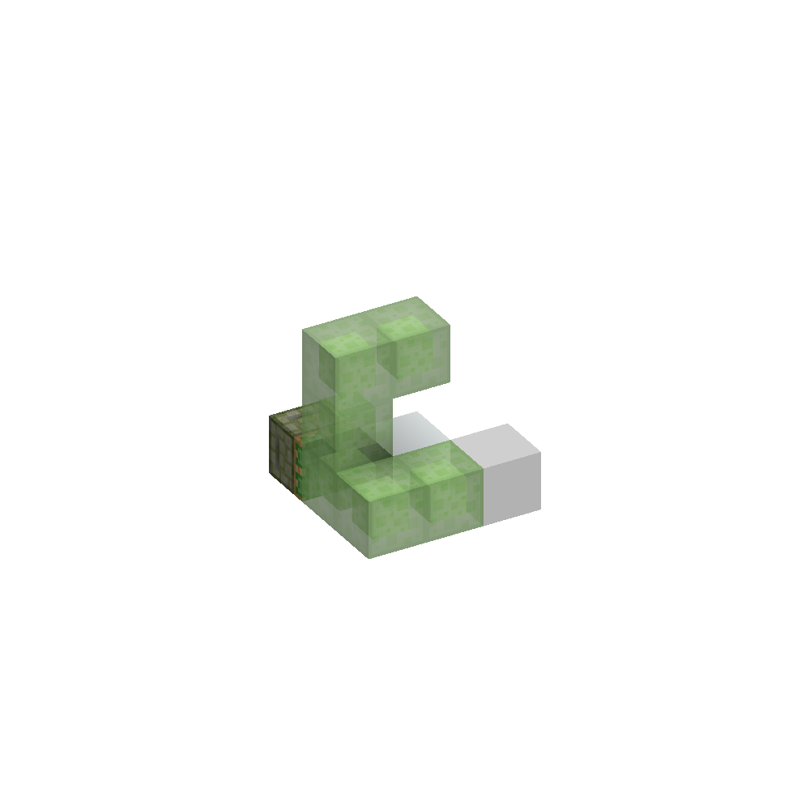

本图的推动轴是+z向-z方向

首先分析直线结构，活塞头前的两格粘液块最先被添入移动方块列表。

由于两格均为可粘方块，最贴近活塞的粘液块尝试分析其-x方向的普通方块，并将其添加进推动方块列表，再分析+y方向的粘液块，将其加入推动方块列表，其会有下一次调用，但此时这个调用任务会被压入系统栈。直线方块的第二格压栈分析其-x方向的粘液块，这个粘液块发现自己和后面的普通方块冲突了，于是处理碰撞，合成的新列表分别是普通方块下标为为3，粘液块下标为4。粘液块检查周围方块的任务被压入系统栈，等待下一轮调用。最后以此类推，最终可以得到整个结构的推动顺序。

当然你要是比较懒不如直接pistorder。

## 5.5 活塞对方块事件的响应

活塞在`PistonBlock.java`内用一个方法`onSyncedBlockEvent`就处理了所有方块事件。因此，活塞对方块事件的一切相应均与此有关。我们将通过解析`onSyncedBlockEvent`来理解活塞的方块事件行为。值得注意的是，这里的`Synced`不应该被误解为“立即执行”之类的，而是服务端与客户端之间的同步。

```java
public boolean onSyncedBlockEvent(BlockState state, World world, BlockPos pos, int actionType, int directionData) {
    // 获取方块的方向（例如，活塞朝向的方向）
    Direction facing = (Direction)state.get(FACING);
    
    // 获取激活的方块状态（表示方块正在扩展）
    BlockState extendedState = (BlockState)state.with(EXTENDED, true);
    
    // 如果当前不是客户端，进行一些服务器端操作
    if (!world.isClient) {
        // 检查是否需要扩展活塞（是否有红石信号）
        boolean shouldExtend = this.shouldExtend(world, pos, facing);
        
        // 如果需要扩展并且事件类型是收缩，更新方块状态并返回
        if (shouldExtend && (actionType == 1 || actionType == 2)) {
            world.setBlockState(pos, extendedState, 2);
            return false;
        }

        // 如果不需要扩展并且事件类型是0，直接返回false
        if (!shouldExtend && actionType == 0) {
            return false;
        }
    }

    // 事件类型为0：活塞伸展事件
    if (actionType == 0) {
        // 如果移动方块失败，返回false
        if (!this.move(world, pos, facing, true)) {
            return false;
        }

        // 设置方块为扩展状态，并播放伸展声音
        world.setBlockState(pos, extendedState, 67);
        world.playSound((PlayerEntity)null, pos, SoundEvents.BLOCK_PISTON_EXTEND, SoundCategory.BLOCKS, 0.5F, world.random.nextFloat() * 0.25F + 0.6F);
        world.emitGameEvent(GameEvent.BLOCK_ACTIVATE, pos, Emitter.of(extendedState));
    } 
    // 事件类型为1或2：活塞收缩事件
    else if (actionType == 1 || actionType == 2) {
        // 获取活塞前方的方块实体
        BlockEntity blockEntityInFront = world.getBlockEntity(pos.offset(facing));
        
        // 如果该位置有活塞方块实体，完成收缩操作
        if (blockEntityInFront instanceof PistonBlockEntity) {
            ((PistonBlockEntity)blockEntityInFront).finish();
        }

        // 创建移动的活塞方块状态
        BlockState pistonHeadState = Blocks.MOVING_PISTON.getDefaultState().with(PistonExtensionBlock.FACING, direction)
                .with(PistonExtensionBlock.TYPE, this.sticky ? PistonType.STICKY : PistonType.DEFAULT);
        
        // 设置新的活塞方块状态，并创建新的方块实体
        world.setBlockState(pos, pistonHeadState, 20);
        world.addBlockEntity(PistonExtensionBlock.createBlockEntityPiston(pos, pistonHeadState, (BlockState)this.getDefaultState().with(FACING, Direction.byId(directionData & 7)), direction, false, true));
        world.updateNeighbors(pos, pistonHeadState.getBlock());
        pistonHeadState.updateNeighbors(world, pos, 2);

        // 如果是粘性活塞，执行特殊逻辑
        if (this.sticky) {
            // 计算目标位置
            BlockPos targetpos = pos.add(facing.getOffsetX() * 2, facing.getOffsetY() * 2, facing.getOffsetZ() * 2);
            BlockState targetState = world.getBlockState(targetpos);
            boolean hasMovingPistonInFront = false;
            
            // 如果目标位置已有移动活塞方块，尝试完成它的扩展
            if (targetState.isOf(Blocks.MOVING_PISTON)) {
                BlockEntity blockEntity2 = world.getBlockEntity(targetpos);
                if (blockEntity2 instanceof PistonBlockEntity) {
                    PistonBlockEntity pistonBlockEntity = (PistonBlockEntity)blockEntity2;
                    if (pistonBlockEntity.getFacing() == facing && pistonBlockEntity.isExtending()) {
                        pistonBlockEntity.finish();
                        hasMovingPistonInFront = true;
                    }
                }
            }

            // 如果没有特殊情况，移除目标方块或继续移动
            if (!hasMovingPistonInFront) {
                if (actionType != 1 || targetState.isAir() || !isMovable(targetState, world, targetpos, facing.getOpposite(), false, direction) 
                        || targetState.getPistonBehavior() != PistonBehavior.NORMAL && !targetState.isOf(Blocks.PISTON) && !targetState.isOf(Blocks.STICKY_PISTON)) {
                    world.removeBlock(pos.offset(facing), false);
                } else {
                    this.move(world, pos, facing, false);
                }
            }
        } 
        // 如果不是粘性活塞，直接移除目标方块
        else {
            world.removeBlock(pos.offset(facing), false);
        }

        // 播放收缩声音
        world.playSound(null, pos, SoundEvents.BLOCK_PISTON_CONTRACT, SoundCategory.BLOCKS, 0.5F, world.random.nextFloat() * 0.15F + 0.6F);
        world.emitGameEvent(GameEvent.BLOCK_DEACTIVATE, pos, Emitter.of(pistonHeadState));
    }

    // 返回true表示事件成功处理
    return true;
}
```

这段代码的执行是分服务端和客户端的，这个概念在前文中就已经被提及，不再赘述。总的来说，活塞的行为有三种类型，分别是：

- 状态码=0，伸出
- 状态码=1，普通收回
- 状态码=2，瞬推收回

因此本篇将根据这三种类型分别阐述其具体行为。

### 5.5.1 服务端

如果不是客户端，那么会执行几个服务端特有的事件：

- 检查激活情况，如果激活，并且方块事件为收回或者瞬推收回，将活塞设置为伸出状态，并进行寻路更新，方块事件执行失败。
- 如果没有激活并且方块事件为伸出，方块事件执行失败。

### 5.5.2 伸出事件

> 注意，本部分无论客户端，服务端都必须执行

活塞会尝试移动前方方块，这是通过`move`方法实现的，我稍后会补充这个方法的细节。如果移动失败，则活塞执行事件失败。

接下来，将活塞设置为伸出状态，此处`bitflag`为`0b01000011`放置移除更新，寻路更新，NC更新

最后，播放活塞深处的声音，方块事件执行成功

### 5.5.3 瞬间收回与收回事件

首先获取活塞头的方块实体，如果是b36，那么使其瞬间到位。

接下来，将活塞设置为b36，此处`bitflag`为`0b00010100`，无PP更新，寻路更新

再将活塞设置成b36方块实体，发出NC更新，PP更新[^4]

[^4]:注意这里NC更新和PP更新并不是同时发生的，实际上是先NC更新再PP更新

如果这个活塞是一个粘性活塞，那么将活塞头伸出1格外的地方，如果它试图放置活塞头的位置的一格外是一个b36，并且该b36的推动方向与活塞同向，那么让方块瞬间到位。

如果活塞行为不为瞬推收回，并且该方块不是空气，活塞可以移动前方一格的方块，而且这个方块可以被正常拉回或者这个方块是活塞或者粘性活塞，那么尝试拉回前方方块。如果前方一格的方块无法被拉动，那么删除活塞头位置的方块。

如果是普通活塞，直接删除活塞头位置的方块。

无论何种情况，播放活塞收回的声音。方块事件执行成功

### [进阶]5.5.4 移动方块

```java
// retract=0：收回
// retract=1：伸出
private boolean move(World world, BlockPos pos, Direction dir, boolean retract) {
    // 活塞头的位置
    BlockPos blockPos = pos.offset(dir);

    // 如果是收缩动作并且目标位置是活塞头
    if (!retract && world.getBlockState(blockPos).isOf(Blocks.PISTON_HEAD)) {
        // 将活塞头设为空气
        // flag=0b00010100, 无PP更新，寻路更新 客户端
        world.setBlockState(blockPos, Blocks.AIR.getDefaultState(), 20);
    }

    // 创建 PistonHandler 实例，用于计算推动或拉回操作的合法性
    PistonHandler pistonHandler = new PistonHandler(world, pos, dir, retract);

    // 如果无法执行推动/拉回操作，则无法移动
    if (!pistonHandler.calculatePush()) {
        return false;
    } else {
        // 使用哈希表存储需要移动的方块及其状态，便于后续处理
        Map<BlockPos, BlockState> map = Maps.newHashMap();

        // 创建移动方块列表并获取移动方块列表
        List<BlockPos> list = pistonHandler.getMovedBlocks();

        // 用于记录需要移动的方块的原始状态
        List<BlockState> list2 = Lists.newArrayList();

        // 遍历需要移动的方块，将其原始状态保存到列表中，并存储到 map 中
        for (int i = 0; i < list.size(); ++i) {
            BlockPos blockPos2 = (BlockPos) list.get(i);
            BlockState blockState = world.getBlockState(blockPos2);
            list2.add(blockState);
            map.put(blockPos2, blockState);
        }

        // 获取所有需要破坏的方块位置列表
        List<BlockPos> list3 = pistonHandler.getBrokenBlocks();

        // 用于记录被破坏方块的状态
        BlockState[] blockStates = new BlockState[list.size() + list3.size()];

        // 确定移动方向
        Direction direction = retract ? dir : dir.getOpposite();

        // 处理被破坏的方块，从后到前
        int j = 0;
        for (int k = list3.size() - 1; k >= 0; --k) {
            BlockPos blockPos3 = (BlockPos) list3.get(k);
            BlockState blockState2 = world.getBlockState(blockPos3);

            // 如果方块有方块实体，则先处理掉落逻辑
            BlockEntity blockEntity = blockState2.hasBlockEntity() ? world.getBlockEntity(blockPos3) : null;
            dropStacks(blockState2, world, blockPos3, blockEntity);

            // 将方块设置为空气并触发销毁事件
            world.setBlockState(blockPos3, Blocks.AIR.getDefaultState(), 18);
            world.emitGameEvent(GameEvent.BLOCK_DESTROY, blockPos3, Emitter.of(blockState2));

            // 如果方块不是火类方块，则添加破坏粒子效果
            if (!blockState2.isIn(BlockTags.FIRE)) {
                world.addBlockBreakParticles(blockPos3, blockState2);
            }

            // 保存被破坏方块的状态
            blockStates[j++] = blockState2;
        }

        // 处理需要移动的方块
        for (int k = list.size() - 1; k >= 0; --k) {
            BlockPos blockPos3 = (BlockPos) list.get(k);
            BlockState blockState2 = world.getBlockState(blockPos3);

            // 移动到目标位置
            blockPos3 = blockPos3.offset(direction);
            map.remove(blockPos3);

            // 设置目标位置为 MOVING_PISTON 状态，用于动画处理
            BlockState blockState3 = (BlockState) Blocks.MOVING_PISTON.getDefaultState().with(FACING, dir);
            world.setBlockState(blockPos3, blockState3, 68);

            // 创建b36方块实体，用于控制移动动画
            world.addBlockEntity(PistonExtensionBlock.createBlockEntityPiston(blockPos3, blockState3, (BlockState) list2.get(k), dir, retract, false));
            blockStates[j++] = blockState2;
        }

        // 如果是伸出操作，添加活塞头
        if (retract) {
            PistonType pistonType = this.sticky ? PistonType.STICKY : PistonType.DEFAULT;
            BlockState blockState4 = (BlockState) ((BlockState) Blocks.PISTON_HEAD.getDefaultState().with(PistonHeadBlock.FACING, dir)).with(PistonHeadBlock.TYPE, pistonType);
            BlockState blockState2 = (BlockState) ((BlockState) Blocks.MOVING_PISTON.getDefaultState().with(PistonExtensionBlock.FACING, dir)).with(PistonExtensionBlock.TYPE, this.sticky ? PistonType.STICKY : PistonType.DEFAULT);
            map.remove(blockPos);

            // 设置当前活塞位置为 MOVING_PISTON 状态
            world.setBlockState(blockPos, blockState2, 68);

            // 添加b36方块实体，用于控制动画
            world.addBlockEntity(PistonExtensionBlock.createBlockEntityPiston(blockPos, blockState2, blockState4, dir, true, true));
        }

        // 将 map 中剩余的方块设置为空气
        BlockState blockState5 = Blocks.AIR.getDefaultState();
        for (BlockPos blockPos4 : map.keySet()) {
            world.setBlockState(blockPos4, blockState5, 82);
        }

        // 更新邻居方块状态
        for (Map.Entry<BlockPos, BlockState> entry : map.entrySet()) {
            BlockPos blockPos5 = entry.getKey();
            BlockState blockState6 = entry.getValue();
            blockState6.prepare(world, blockPos5, 2);
            blockState5.updateNeighbors(world, blockPos5, 2);
            blockState5.prepare(world, blockPos5, 2);
        }

        // 更新被破坏方块的邻居状态
        for (int l = list3.size() - 1; l >= 0; --l) {
            BlockState blockState2 = blockStates[j++];
            BlockPos blockPos5 = (BlockPos) list3.get(l);
            blockState2.prepare(world, blockPos5, 2);
            world.updateNeighborsAlways(blockPos5, blockState2.getBlock());
        }

        // 更新移动方块的邻居状态
        for (int l = list.size() - 1; l >= 0; --l) {
            world.updateNeighborsAlways((BlockPos) list.get(l), blockStates[j++].getBlock());
        }

        // 如果是收缩动作，更新活塞位置邻居
        if (retract) {
            world.updateNeighborsAlways(blockPos, Blocks.PISTON_HEAD);
        }

        return true; // 如果执行成功，返回 true
    }
}

```

活塞尝试移动方块时，会区分两种情况，伸出和收回。这里的`retract`布尔值代表了活塞的动作，当其值为`false`时，活塞收回，当其值为`true`时，活塞伸出，接下来，活塞会区分两种活塞动作，分别处理。

当活塞**尝试**收回时，游戏会首先检查**预期是**活塞头的位置是不是活塞头，如果是活塞头才执行收回。每次执行收回时，游戏都会先将活塞头的位置设置为空气（删除活塞头）。此时的`setBlockState`的传入`bitflag`为`0b00010100`，即无PP更新，和客户端的寻路更新。

在正式开始移动前，无论收回或伸出，游戏都会调用[5.4.2](#进阶542-移动结构分析)部分分析的`calculatePush`方法，再次分析是否可以移动，如果不能成功移动，则活塞执行推动/拉动失败。

接下来，游戏会正式开始移动方块，它首先会逆序地处理破坏方块列表(`brokenBlocks`)，如果被破坏的方块具备掉落物品的方块实体，那么掉落物品，再将被锚定破坏的方块（也就是当前正在处理的方块）设置为空气，此时无PP更新，发出寻路更新。

破坏了应该破坏的方块后，游戏会开始移动方块。从后往前遍历移动方块列表(`movedBlocks`)，将该方块设置为b36，`bitflag`为`0b01101000`，也就是放置移除更新，再向该方块添加b36的方块实体，并添加到`blockStates`列表中备用。

如果是伸出，就在活塞头位置创建b36，放置移除更新，再向活塞头位置添加b36方块实体。

完成以上操作后，将未被覆盖到的方块全部设置为空气，并放置移除更新，寻路更新。此时无PP更新。再统一发出更新，对于哈希表中所有的方块，都先统一发出红石粉prepare更新，再给出方块更新（在方块原位置），如果是伸出，活塞头完成方块更新。这只是较为简单的表述，更为准确和复杂的表述可以看[5.6](#56-更新顺序)。

以上代码很好的解读了[5.4.5](#进阶545-移动方块列表处理)内提到的一些当时并未彻底解释清楚的东西，比如b36的添加为何是倒序与`movedBlocks`列表。

### 5.5.5 瞬时到位

> 对于其它类型的到位，可以查看[5.7](#57-b36的到位)

我在此处提到瞬时到位，是因为其不具备一般b36对方块实体阶段的等待环节，而是直接瞬时到位，这里的瞬时到位也稍不精确，事实上，局限于活塞的执行阶段，所谓瞬时到位实际上总是在方块事件阶段完成。考虑到这点，我将瞬时到位归入5.5这一部分。本部分中，考虑到代码部分实际上已经被分析过了，我在此处更多的想从行为上，观测上的方面去了解这一特殊行为。

我们在前文中已经强调了触发瞬时到位总是满足以下条件：

- 收回事件，活塞头位置的方块为b36
- 收回事件，粘性活塞伸出方向一格外为b36并且该b36朝同方向移动

我们在此处分门别类地讨论这两种情况。

> 这部分的实例我觉得五羊飞写的真的很好，就偷过来用了（逃

**活塞头位置为b36**

我们看如下的一个实例：

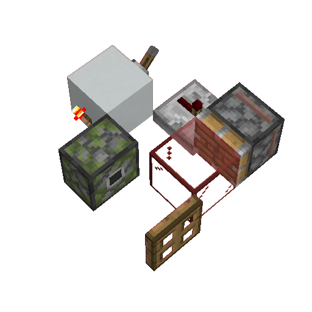

在这个实例中，红色玻璃被瞬间到位，这是从观测角度而言的，而从理论上，我们给出如下解释：

中继器的优先级高于红石火把，所以普通活塞先添加方块事件，无头粘性活塞再添加方块事件，尝试拉回更前方1格的方块（实际上此时actionType=1）

但是，在BE阶段，由于b36的插入，粘性活塞拉回受阻，并不会破坏这个b36，此时活塞头位置为b36，触发瞬时收回，红色玻璃瞬时到位。

**粘性活塞伸出方向一格外为b36且b36移动方向与活塞移动方向一致**

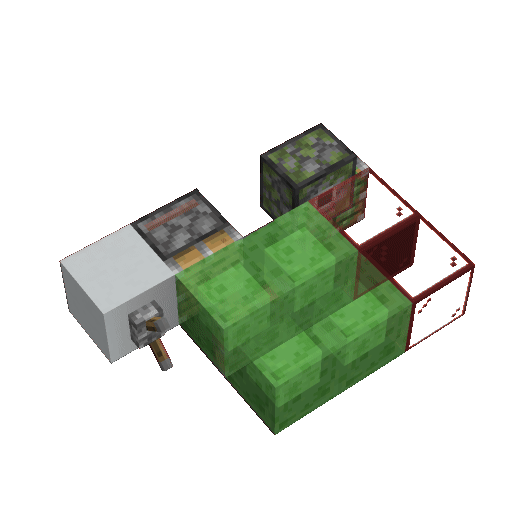

在以上实例中，红色玻璃被瞬时到位，是因为：

活塞推动粘液棒子，红色玻璃被移动，发出NC更新，触发无头粘性活塞的自检。此时，粘性活塞可以成功拉回，并且在伸出方向一格外存在b36，该b36推动方向与粘性活塞推动方向是一致的，因此被瞬时到位。

---
当然，值得注意的是，这种瞬时到位只会影响一格方块，也就是粘性活塞面前的方块，其余方块仍然会被转化为b36，所以，我们可以利用这一点稍微解读一下一种在许多人看来是魔法的装置：

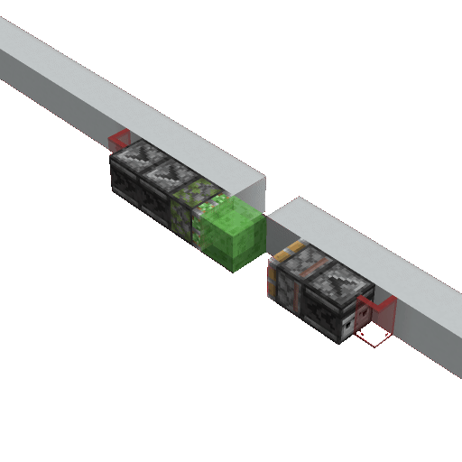

在这个装置中，当拉杆被拉下，粘性活塞会在方块到位1gt后移动它侧翼的方块，此时这个方块被粘液块带着向前推动，但由于粘性活塞是被侦测器激活的，该粘液块被提前到位，被活塞回推，而此时这个方块尚处于b36的状态，因此被留在了被带过去的位置，这样就实现了对方块流的延长。

## 5.6 更新顺序

> 本部分更多的是概括性表述，而非实际上对代码的详细解读。

活塞的更新顺序总的来说分为五种情况，分别是：

- 活塞/粘性活塞只伸出不推动/破坏方块
- 活塞/粘性活塞只收回不影响方块
- 活塞/粘性活塞推动方块
- 粘性活塞收回方块
- 粘性活塞拉回失败

如果将更新顺序细分至每个方块的话，总的来说顺序上是等价于创建b36的顺序的。而未被覆盖的方块的更新顺序，鉴于使用了哈希表，是随机的。

### 5.6.1 活塞/粘性活塞只伸出

同[5.6.3](#563-活塞粘性活塞推动方块)，只是移动方块为空

### 5.6.2 活塞/粘性活塞只收回

1. 创建活塞底座b36，发出PP更新和NC更新
2. 移除活塞头，发出PP更新和NC更新

（这里suppose会有流程图，有空补）

### 5.6.3 活塞/粘性活塞推动方块

1. 移除破坏方块位置的方块
2. 在移动的目标位置创建b36，发出PP更新
3. 创建活塞头b36，发出红石粉prepare更新与PP更新
4. 在破坏方块位置发出红石粉prepare更新和NC更新
5. 在移动原位置发出NC更新
6. 在活塞头位置发出NC更新
7. 在活塞底座发出PP更新和NC更新。

（这里suppose会有流程图，有空补）

### 5.6.4 粘性活塞收回方块

1. 创建活塞底座b36，发出PP更新和NC更新
2. 移除破坏方块位置的方块
3. 在移动目标位置创建b36，发出PP更新
4. 移除未被覆盖的方块，发出红石粉prepare更新，PP更新
5. 移动原位置，发出NC更新

（这里suppose应该会有流程图，有空补）

### 5.6.5 粘性活塞收回失败

1. 创建活塞底座b36方块，发出PP更新和NC更新

我们发现，这个行为中不具备任何在活塞头的更新，也就是我们常说的粘性收回方块失败无更新。这里给几个实例：

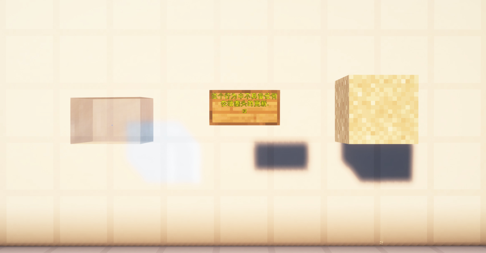


## 5.7 b36的到位

### 5.7.1 普通到位

```java
public static void tick(World world, BlockPos pos, BlockState state, PistonBlockEntity blockEntity) {
        //记录当前gt
    blockEntity.savedWorldTime = world.getTime();
    blockEntity.lastProgress = blockEntity.progress;
    //如果推动已完成
    if (blockEntity.lastProgress >= 1.0F) {
        //如果是客户端且当前deathTick没有超过5
        if (world.isClient && deathTicks < 5) {
            //增加deathTicks计数
            ++deathTicks;
        } else {
            //移除方块实体
            world.removeBlockEntity(pos);
            blockEntity.markRemoved();
            //如果该方块为b36
            if (world.getBlockState(pos).isOf(Blocks.MOVING_PISTON)) {
                //给出PP更新
                BlockState blockState = Block.postProcessState(blockEntity.pushedBlock, world, pos);
                //如果为空气
                if (blockState.isAir()) {
                    //设置为对应方块，无更新，bitflag=0b01010100;
                    world.setBlockState(pos, blockEntity.pushedBlock, 84);
                    //更新或破坏该方块
                    Block.replace(blockEntity.pushedBlock, blockState, world, pos, 3);
                } else {
                    //如果是含水方块
                    if (blockState.contains(Properties.WATERLOGGED) && (Boolean)blockState.get(Properties.WATERLOGGED)) {
                        //移除含水方块中的水
                        blockState = (BlockState)blockState.with(Properties.WATERLOGGED, false);
                    }
                    //设置为对应方块，给出NC更新，PP更新，客户端更新，bitflag=0b01000011
                    world.setBlockState(pos, blockState, 67);
                    //自身受到NC更新
                    world.updateNeighbor(pos, blockState.getBlock(), pos);
                }
            }
        }
    } 
    //如果推动未完成
    //推动进度+0.5
    else {
        float f = blockEntity.progress + 0.5F;
        //进行实体运算
        pushEntities(world, pos, f, blockEntity);
        moveEntitiesInHoneyBlock(world, pos, f, blockEntity);
        blockEntity.progress = f;
        //如果推动进度>=1，取为1
        if (blockEntity.progress >= 1.0F) {
            blockEntity.progress = 1.0F;
        }
    }
}
```

在每个游戏刻的方块实体阶段（TE阶段），b36会检查自己推动是否完成，如果完成，那么标记为移除，等待世界运算移除。如果当前方块确实是b36，那么给出PP更新。

首先，如果当前方块为空气，也就是活塞臂收回时创建的b36，那么将其变回空气，并更新该位置。如果该位置不是空气，那么移除含水方块中的水，设为对应方块，并给出NC更新，PP更新，客户端更新，最后再给出一次NC更新。

如果没有完成推动的话，那么会给自己的推动进度+0.5，并且进行实体相关运算，我们稍后会在[b36相关的实体运算](#572-b36相关的实体运算)详细了解。这里我们可以稍微解释一下所谓活塞3gt延迟是怎么来的：

1. gt0
   - BE：开始推动，创建b36
   - TE：进度+0.5 移动实体
2. gt1
   - TE：进度+0.5 移动实体
3. gt2
   - TE: 发现进度已经到位1 变回方块

这就是为什么会有所谓活塞3gt延迟的说法。

### 5.7.2 b36相关的实体运算

（Petris要负责的部分）

### 5.7.3 瞬时到位

```java
public void finish() {
    // 存在世界且进度未满或客户端运算
    if (this.world != null && (this.lastProgress < 1.0F || this.world.isClient)) {
        // 将进度设置为完成
        this.progress = 1.0F;
        this.lastProgress = this.progress;
        // 移除方块实体
        this.world.removeBlockEntity(this.pos);
        this.markRemoved();
        //如果此处为b36方块
        if (this.world.getBlockState(this.pos).isOf(Blocks.MOVING_PISTON)) {
            // 如果是产生移动的活塞
            BlockState blockState;
            if (this.source) {
                // 设置为空气
                blockState = Blocks.AIR.getDefaultState();
            } else {
                // 否则在PP更新后到位
                blockState = Block.postProcessState(this.pushedBlock, this.world, this.pos);
            }
            // 设置方块，PP更新，寻路更新，NC更新
            this.world.setBlockState(this.pos, blockState, 3);
            // 自身受到方块更新
            this.world.updateNeighbor(this.pos, blockState.getBlock(), this.pos);
        }
    }
}
```

在瞬时到位时，会直接强制到位，将进度设置为完成，移除方块实体。如果当前位置为b36方块，会判断当前位置是否为产生移动的活塞，如果是则直接替换为空气，否则变成对应的方块。到位后，给出NC更新，PP更新，寻路更新。

值得注意的是，由于笨蛋麻将并没有在这部分写任何实体运算或对含水方块的特殊判断，所以瞬推不会影响实体，也不会消除含水状态。但是值得注意的是，如果在此前经历了TE阶段的实体运算，在此前的实体运算会被保留，仅有当前gt的TE阶段的实体运算会被忽略。

## 5.8 方块事件延迟

方块事件延迟(Block Event Delay)，简称BED，是一种独属于方块事件的阶段内延迟，这意味着仅有能够发出方块事件的方块才可以参与BED的计算。在本部分内，我们将会详细探讨以下内容：

1. 什么是方块事件延迟？
2. 方块事件延迟的执行顺序
3. 实例分析

### 5.8.1 什么是方块事件延迟？

篇首的图片右侧，一排活塞正在相互更新，处于不同的伸出阶段。这个时候就有读者要问了：欸这些活塞不应该都同时推出吗？为什么在这里不是同时？

非常好问题！但是MC的世界观告诉我们，MC的世界中不存在绝对同时，这些活塞的伸出必须得有个先后。正是这个先后顺序造成了方块事件延迟。

### 5.8.2 方块事件延迟的成因

在阅读过更新理论后，各位已经意识到了这坨活塞应该是从左到右更新的，也就是说，方块事件的添加顺序就是从左到右了。那么游戏是按照顺序执行的吗？是的没错，游戏就是按这个顺序执行的，第一个进去的第一个执行，第二个进去的第二个执行，最后一个进去的最后一个执行。如何观测呢？我们做一个小实验：

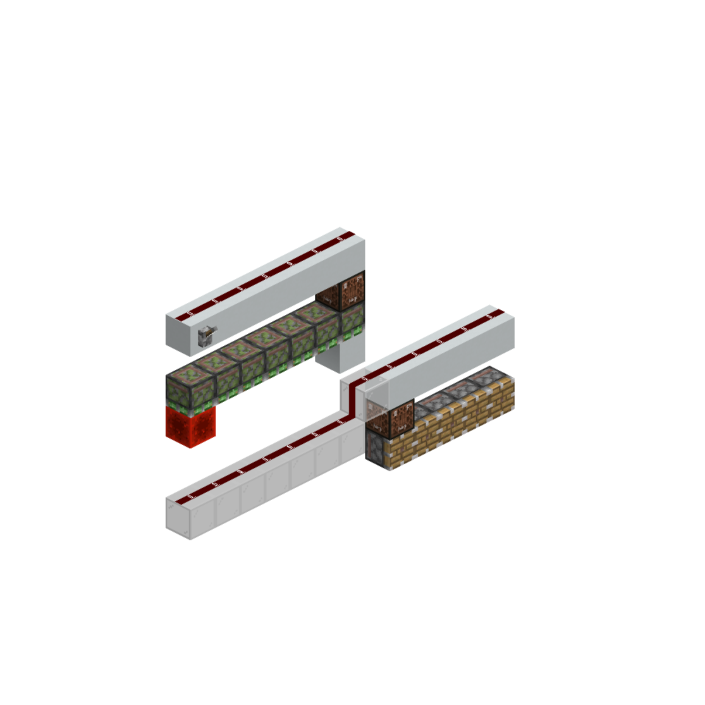

开关拉杆，我们发现，当改变红石块的位置的时候，旁边活塞推出的数量发生了变化，当红石块靠近压线方块的时候，数量减少了，而当红石块远离压线方块的时候，数量增多了。这意味着，其从实际上符合我前面提出的顺序。如果你已经阅读过前面几章的进阶部分，那么你应该已经知道了队列的概念。没错，方块事件的本质同样是一个队列。

如果没有阅读过也没有关系，你可以将方块事件想象成人在排队，先来的先执行，后来的后执行。

### 5.8.3 实例分析

下图是一个非常典型的树场下吸底座，让我们分析一下它的时序：

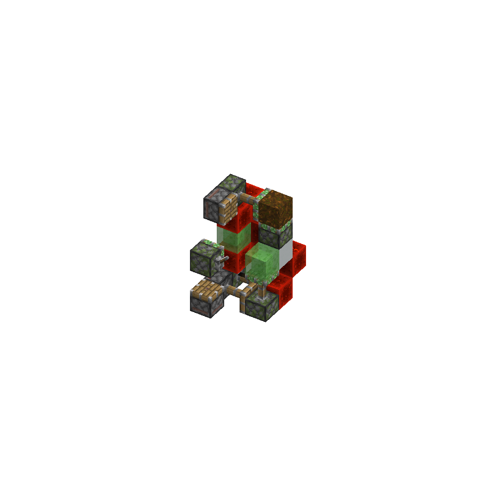

0gt AT：拉杆被拉下

1gt BE 深度0：粘性活塞开始收回

1gt BE 深度1：粘性活塞将灰化土拉回，转向粉转向，下吸活塞被更新，伸出，随后下方激活方块被转化为b36，充能源消失，粘性活塞0t发生


3gt TE：全部方块均到位。

4gt BE 深度0：两个普通活塞伸出

4gt BE 深度1：普通活塞伸出，更新粘性活塞，回推粘性活塞伸出，底座激活活塞自检。

4gt BE 深度2：粘性活塞自检，0t发生，回推粘性活塞自检，灰化土瞬间到位。红石块到位，控制下吸活塞充能方块的粘性活塞确定伸出。

6gt TE：红石粉被转向，充能方块到位，底座完成重置。

(有些人要问了，你不提一下音符盒不计入深度这回事吗？虽然但是，这是错误的表述，你在只关注活塞的情况下的确如此，但是深度的正确定义应该是方块事件队列内的下标)

### [进阶]5.8.4 广度优先搜索与方块事件队列

虽然本部分被标注了进阶部分，但实际上本段并不是着重于分析什么极为高深或复杂的内容，只是读者在超过99%的情况下用不到。

如果你对BE队列和更新理论已经有了相对比较深刻的理解，那么我接下来要讲的东西实际上非常简单。由于队列的存在，本来的更新栈被转化为了所谓“广度优先搜索”。

什么是广度优先搜索呢？这里给出一图流解释：

[^5]

[^5]:本图作者 Blake Matheny - Transferred from en.wikipedia to Commons.，CC BY-SA 3.0，https://commons.wikimedia.org/w/index.php?curid=1864649

用自然语言表述其过程为：

1. 首先将根节点放入队列中。
2. 从队列中取出第一个节点，并检验它是否为目标。
    - 如果找到目标，则结束搜索并回传结果。
    - 否则将它所有尚未检验过的直接子节点加入队列中。
3. 若队列为空，表示整张图都检查过了——亦即图中没有欲搜索的目标。结束搜索并回传“找不到目标”。
4. 重复步骤2。

但在这里没这么多事，我们结合更新理论去理解：

这里给出一个例子

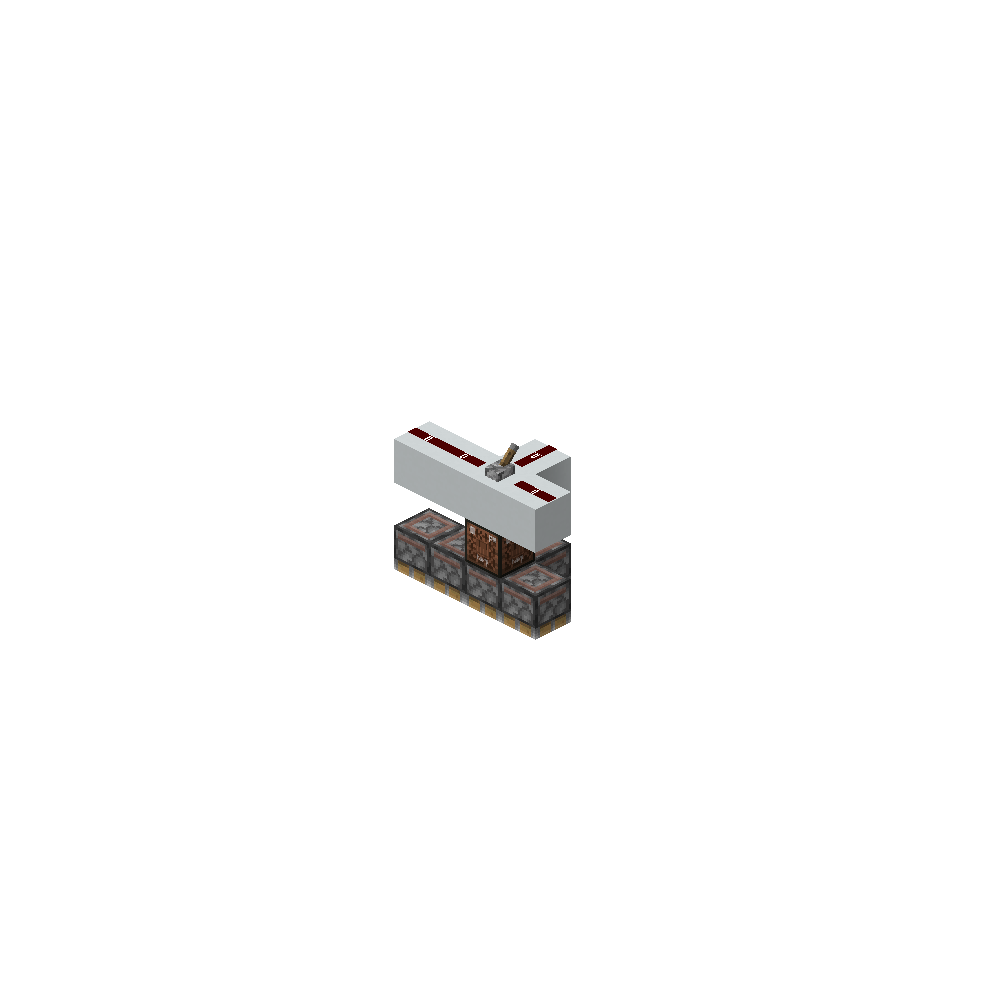

其中长边从+x延伸至-x方向

当拉下拉杆时，中心活塞被激活，并以-x、+x、+z的顺序更新周围三个活塞，依次将它们压入队列。游戏随后按顺序执行-x方向和+x方向的活塞，然后更新+x方向的下一个活塞。此时会添加方块事件并将其压入队列，位于+z方向活塞之后。接着执行+z方向活塞，最后执行+x方向的最后一个活塞。

我们可以将每个活塞抽象为一个节点，把深度为0的活塞视作根节点。需要注意的是，在实际情况中，这个图可能存在多个源点。我们对这个抽象出的"活塞图"进行多源BFS模拟，其中子节点加入队列的顺序就是NC的更新顺序，这个顺序由子节点相对于父节点的方向决定。已被访问过的子节点将不会被重复访问。

## 5.9 复制

### 5.9.1 亮起侦测器的移除运算

```java
public void onStateReplaced(BlockState state, World world, BlockPos pos, BlockState newState, boolean moved) {
    //方块发生改变
    if (!state.isOf(newState.getBlock())) {
        // 非客户端，侦测器亮起，正处于计划刻
        if (!world.isClient && (Boolean)state.get(POWERED) && world.getBlockTickScheduler().isQueued(pos, this)) {
            //向后方发出NC更新，熄灭自己
            this.updateNeighbors(world, pos, (BlockState)state.with(POWERED, false));
        }
    }
}
```

亮起侦测器被移除时会向后方发出NC更新并熄灭自己。

### 5.9.2 基于侦测器的复制

复制的本质实际上是这个方块添加进了移动列表，但是这个时候方块还没转化为b36。我以某种迅雷不及掩耳盗铃的姿势插入一个更新，这个时候这个更新导致了某些东西被激活/掉落，但是因为这个方块本身已经滚进移动方块列表，到位的时候又被以b36的形式放下来了。

我们将复制分为两种，基于侦测器和基于附着性方块的。其中，基于侦测器的复制正利用了上述只要侦测器被移除（换成了b36）的时候就会瞬时产生NC更新。

这里给出基于侦测器的铁轨复制：


在移动方块列表中，当粘性活塞推出时，会先移动左侧侦测器，在目标位置创建b36，再移动粘液块，覆盖了亮起侦测器，更新，铁轨发现下面居然是b36，掉落。移动铁轨，在目标位置创建b36。

这样我们就完成了一次复制

### 5.9.3 基于附着性方块的复制

附着方块的掉落同样会产生更新，但是由于附着方块通常会直接掉落而难以二次利用。例如：

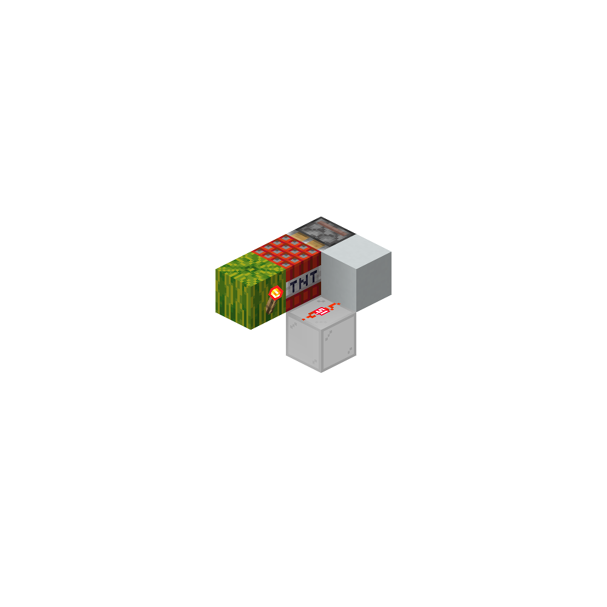

而幸运的是我们活在1.20.1，所以我们有一种能被推动的附着方块：珊瑚扇

下图中是一种极为流行的地毯复制:

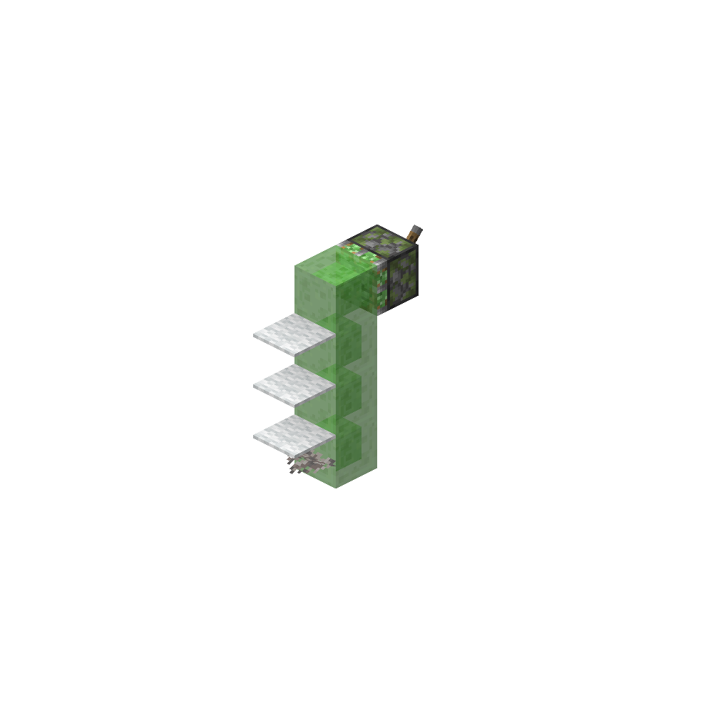

当活塞收回时其完成一次复制，我们在这里对其稍做分析：

移动方块列表：

1. 移动最下方的粘液块，在目标位置创建b36
2. 移动失活的珊瑚扇，在目标位置创建b36，发出PP更新，自检发现自己应该掉落，发出PP更新和NC更新，引导上方地毯连锁掉落
3. 移动其余粘液块和地毯

这就完成了复制。

## 5.10 信息不一致的方块事件

### 5.10.1 推动上限检测

方块事件也会出现活塞觉得自己要执行的事件与实际状况不一致的情况，最典型的便是推动上限检测。


推动上限检测，是由_Kayleigh和Landmining两位玩家最早发现的，其本质是在“欺骗”活塞。具体原理我们稍后解释。现在供大家分析的这个版本，是Bright_Observer制作的较为精简的版本之一。

这个设计本身是具有方向性的，但此处并不重要。其方向性不影响其检测功能。因此，读者可以在任意方向建造此装置而无需担心损坏。

先说最直观的现象：拉下拉杆，敲击音符盒，普通活塞推出。松开拉杆，敲击音符盒，普通活塞不推出。这是为什么呢？

当上推活塞在TT阶段被更新时，它会计划推动。但是我们上文也说过了，计划推动的时候会检查其是否达到推动上限，而此时上方的玻璃没有收回，若拉杆拉下，活塞伸出，则会无法推动。因此得以激活两个普通活塞，再更新到粘性活塞。粘性活塞再次自检，伸出。若拉杆松开，则一切正常，粘性活塞正常推出，两个普通活塞靠上方的一个是否推出取决于朝向，而由深度影响，下方活塞总是不会推出。这也就完成了检测。

在上方实例中，我们发现，粘性活塞计划时添加的方块事件未必等价于其实际推出时的状况。

### 5.10.2 铁头功破基岩

我们前面说到，方块事件的信息结构本质上只有方块位置和方块类型，没有方块状态。（其实是有的，data数据域里有，但是那玩意只是拿来创建b36什么的，在执行方块事件的时候没用）所以，这就让~~心怀不轨~~的某些玩家发现了不得了的事情：

如果，只是说如果，可以在活塞伸出的时候通过某种手段让它突然改变朝向，是不是可以得逞什么事情？比如破基岩啥的。毕竟方块状态是当场获取的，只会检查方块类型和方块位置和原来一不一样。执行的时候又不会检查方向是不是和原方向一致。

于是，铁头功破基岩便应运而生。TNT在EU阶段爆炸破坏充能源更新活塞，活塞受到收回的方块事件，问题是此时也把活塞爆了，此处变成了可放置的空气。按理来说在这个时候方块类型应该是空气，和原来不一样，但是AT阶段玩家连点放置向下的活塞，取代了空气，到了BE阶段游戏一看：同样是活塞，同样在这个位置，好！可以执行！于是执行活塞收回的方块事件，活塞收回，把基岩顶掉了。

大伙口中说的结论：“铁头功破基岩得用一样的活塞。”便是这么来的了。

## 5.11 无头活塞

### 5.11.1 无头活塞的创建

创建无头活塞的办法其实很多，有炸的，有通过卡顿的，有通过结构生成的，也有通过特殊信号的。
