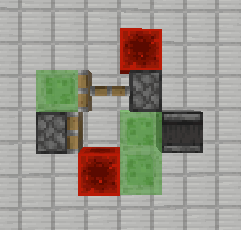

# #13 飞行器入门

---

经过整整两节的学习, 我们终于要做一个可以动的机器啦!

本节课我们只学一点点简单的飞行器, 这里咱会一步一步的分析飞行器的运动, 学习起来会比前两节简单很多哒.

## 1.3.1 原理

_左脚踩右脚, 螺旋升天!_

高中物理的动量彻底毁了我们的武侠梦, 所幸的是, mc的方块又没有动量的概念. 所以我们可以做到如下操作.

如图所示, 我们实现了"左脚踩右脚"的过程, 这个过程中作为"右脚"的普通活塞位置没有变化.

如图所示, 为把"右脚"拉回的过程, 这个过程中粘性活塞位置没有变化.

上述两个过程, 整个结构变向前移动了一格, 我们连贯起来.

将按顺序激活的电路塞到飞行器本体中, 就是简单的飞行器了.

## 1.3.2 简单飞行器

如图所示是个非常容易理解的9gt单向飞行器

其中右向的为普通活塞, 左向的为粘性活塞, 打掉红石块以启动.

我们使用 `/tick freeze` 和 `/tick step` 来观察一下这个飞行器的运行.

## 1.3.3 挂载与拓展