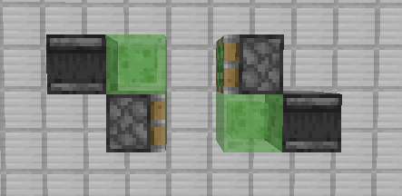
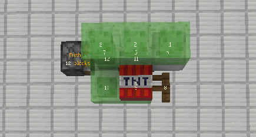
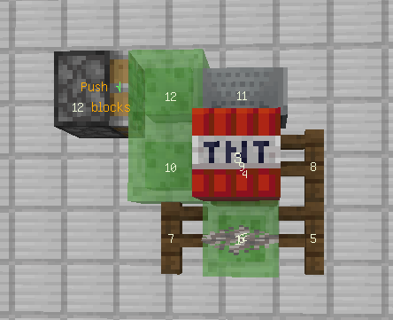
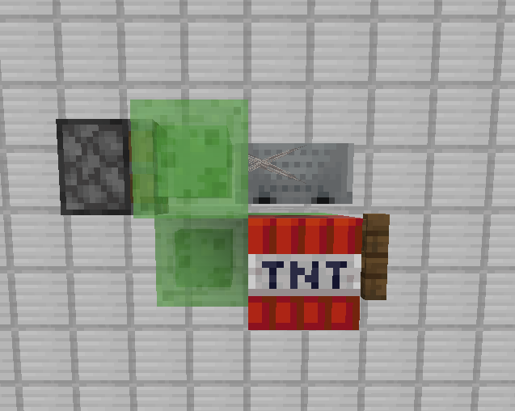
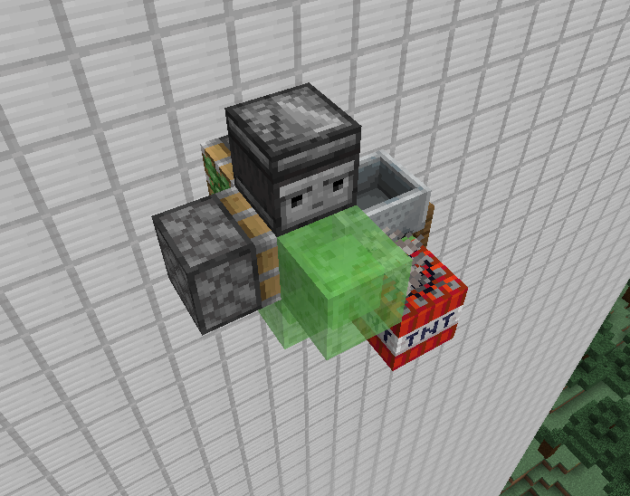
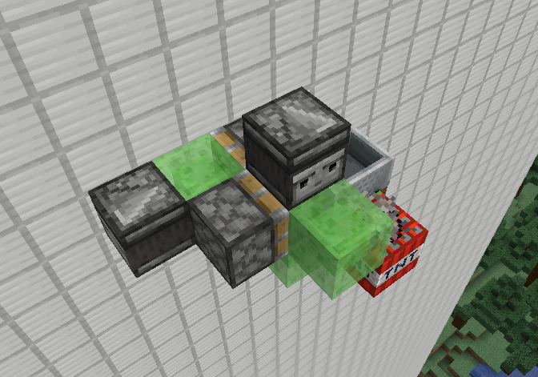
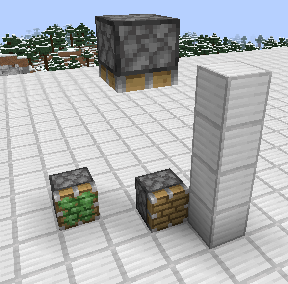
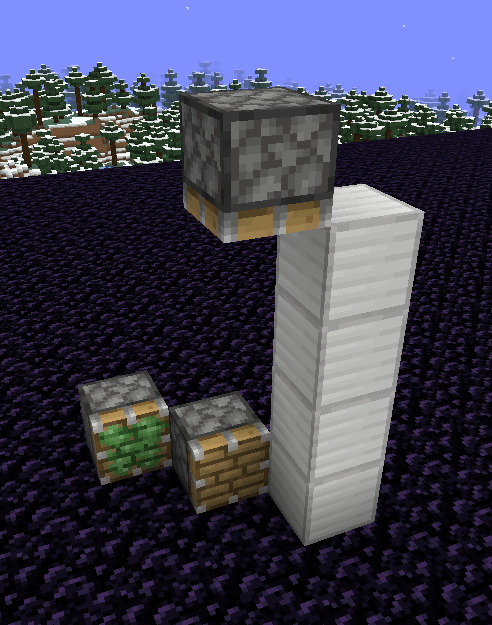
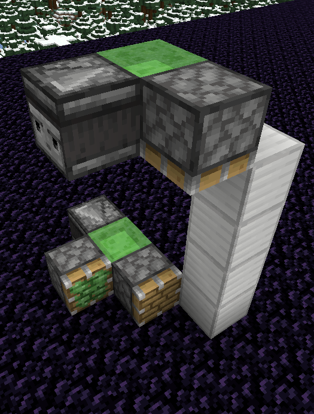
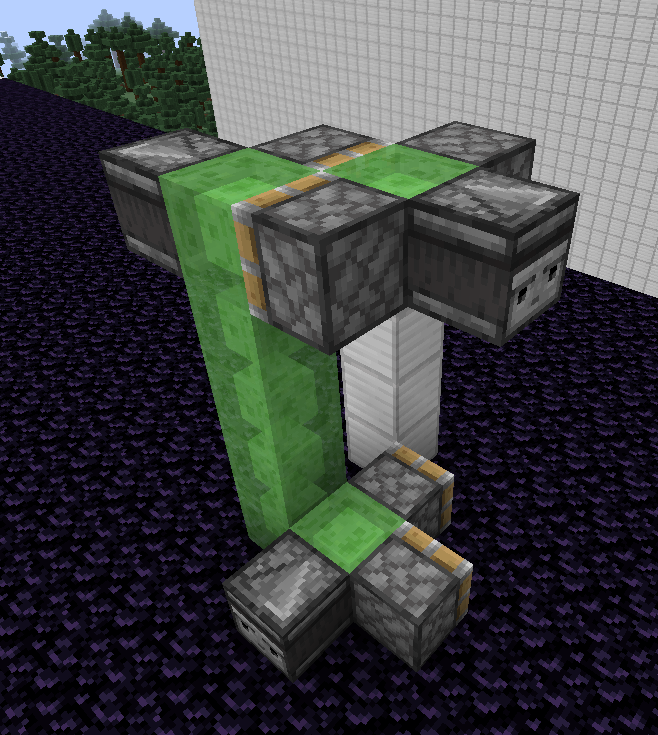

# #21 能动

---

本节我们要实现一个 _把"能动"拓展成结构_ 到 _使结构能动_ 的目标, 也就是, 不要再往引擎上挂东西了, 我们直接使有效结构飞起来.

## 2.1.1 基本能动结构

上一节中我们讲解了能动的原理, 以及给出了基础的10gt飞行器. 10gt飞行器中, 我们可以提取出能动结构如下

其中必要的结构为:

- 两个相向的活塞, 至少一个为粘性活塞
- 两个侦测器, 分别激活两个活塞
- 用于连接的粘液块

将有效结构拓展为飞行器, 便是补全这三个必要结构. 

其中, 由于有效结构必然含义粘液块(小概率无), 因此优先使用已有的粘液块, 最好不要引入新的粘液块.

接着, 若有效结构中含有侦测器 - 活塞结构, 优先利用原有侦测器. 也就是把活塞添加到侦测器能激活的位置. 最好不要引入新的侦测器.

最后, 放置活塞. 注意避免超过推限, 以及保证所以结构都可以得到连接和移动.

## 2.1.2 示例

接下来便是练习过程, 本节无法更细的划分, 熟能生巧罢了. 而且, 上述原则也并非必须遵守, 部分玩家就喜欢引入新的粘液块或侦测器, 实际上反而可以使整个机器更简洁更优雅.

### a) 几种TNT复制机

_图为哈尔威的落点矫正双向TNT复制机_

该TNT复杂机已达到12b, 且无法修改内部任何结构, 只能使用飞行器挂载此结构, 无法使其直接移动.

诸如此类的结构还有如图所示的大火力双向TNT复制机.

如图的简单TNT复制结构, 我们可以使用活塞正对的粘液块作为上述第三点的粘液块. 也就是活塞和侦测器都连接在这个位置, 如图所示.

这样, 我们再补全另一部分的粘液块和侦测器.

这样简单TNT复制机就可以正常移动了.

实际上, TNT复制机大多使用现成的结构, 如上一节的ilmango世界吞噬者的轰炸机模块.

### b) 已知活塞结构

对于上一节留的问题, 我们可以摆出这样的活塞结构, 只要按顺序使活塞移动即可

由于不可避免的粘连问题, 对于初学者解决较为困难, 这里我们把地板换成黑曜石, 暂且不考虑地板的粘连问题

压缩一下活塞, 此时我们需要保证下方先移动一格, 然后上方移动一格, 再接下来下方移动, 正好可以对应飞行器的两个部分.

连接好粘液块和侦测器

接下来完成飞行器如下

如图, 我们实现了上方结构的史莱姆方块多用和侦测器多用, 下方由于距离较远, 无法连接.

接下来备份, 测试(虽然结构简单, 备份用处不大, 但是养成习惯还是比较好的)

### c) 已知非活塞结构

