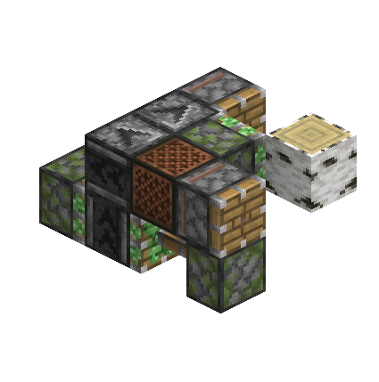
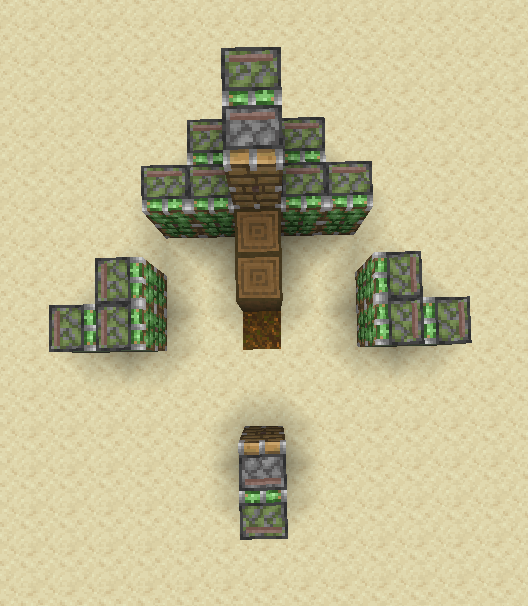
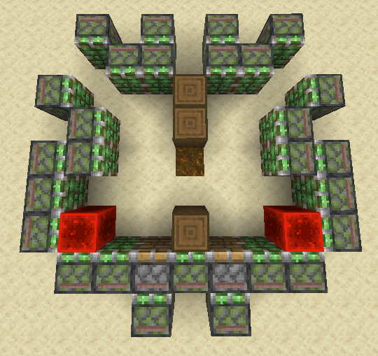
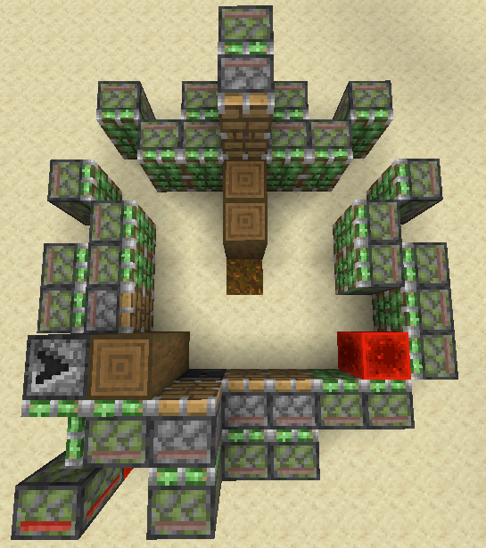
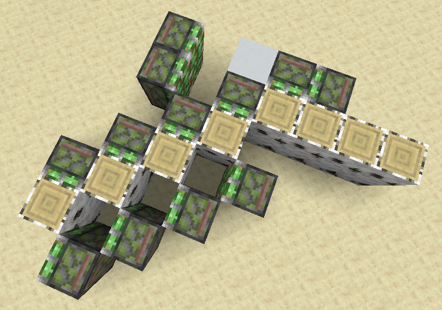
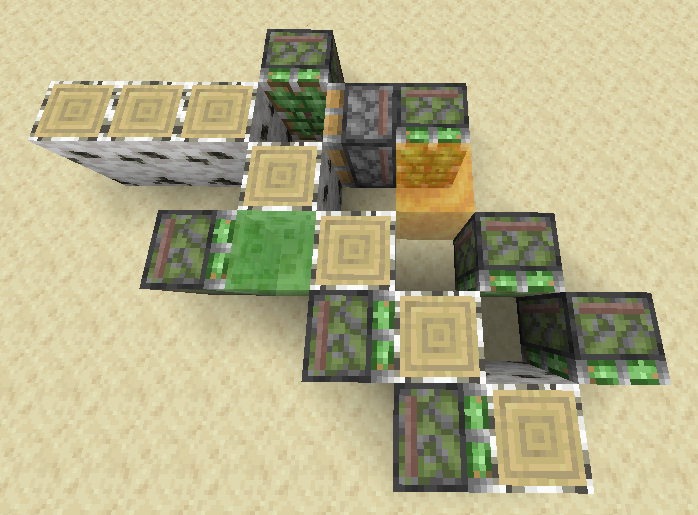

# 07 【进阶】关于4gt树场的一切

*这一章需要将前面的知识最大限度地综合起来，对于过往提到的部分，我们都会写出第一次提到的地方，~~hope you enjoy overbraining~~*

<!--由于本章没图完全讲不了，这里充斥着星河的劣质制图，最好换掉-->
开始之前，我们必须提一嘴：虽然检测式的4gt树场确实存在，但是较为复杂，**我们最后简单讨论**。这里其余的树场都是**以4gt时钟驱动运行的**

>以及，由于一个活塞动作是3gt，所以你完全让树场跑在3gt时钟下，但很显然这就需要我们用来连点器催熟。传统意义上，任何使用连点器的树场都是不被认可的。不过现在12gt和8gt大云杉已经成为特例了

## 7.1 4gt白桦

无论怎么说，还是得先从最简单的开始：4gt白桦

由于4gt主干与底座独立性较强~~且底座几乎可以套公式~~，这里我们先讲主干——核心架构设计

### 7.1.1 核心架构与时序设计

这里我们讲两个典型的比较简单的架构：

*这是一个非常古早的架构，某种意义上似乎已经无从考证最初的设计者了，不过它也是非常好的用于分析4gt设计的实例之一*

首先分析一下时序（建议先自己尝试设计一下，再看我们给出的时序）：

- 第一个周期 首先1号活塞0t，将处理用的原木推到中心，将原木向下推走；然后2号活塞0t，将原木收回

- 第二个周期 首先2号活塞0t，将处理用的原木推到中心，将原木向右推走；然后1号活塞0t，将原木收回，**复位**

显然每一个周期都只包含“一个活塞动作”（*所有活塞都只进行一次同步的动作*），只需要3gt就可以完成，因此这显然可以作为4gt树场的架构

>为了架构清晰，我们移除了树叶处理。你可以尝试自己设计一个。

*这个架构就没这么古早了，是星河做的，时序会略微复杂一点*

时序：（都在`0gt BE`） 1号活塞0t推出上方原木；随后3号活塞0t收回下方原木，4号活塞向下0t推出原木；随后2号活塞0t横向收回原木，**复位**

这样我们同样完成了“一个活塞动作”内处理原木的任务

>这里我没有引入收回式的架构设计：它的复杂度对于白桦而言完全没有必要。待会在4gt全树种的部分我们要解决关于它很多很多很多的问题

### 7.1.2 4gt底座与树苗循环系统

如[4.2.1](./04-为什么你的树场慢——高速树场入门.md)所述，一般而言我们使用下吸或侧吸处理树根。对于4gt而言，**三发+侧吸**是比较方便的选择

由于侧吸活塞在2gt te就完成了收回动作，我们只需要让横向推出的活塞立刻推出，**并在4gt BE结束前收回**，我们就可以轻松地设计一个4gt侧吸根部处理。

>事实上，下吸也是可以用的。传统上我们会使用两个分别处在x轴和z轴上的3gt归位泥土的下吸模块；后来，hampter发表了通过粘液块推拉实现整体4gt复位的下吸架构，如下图

侧吸架构给我们留了一个非常美妙的挂机位置：站在侧吸下方，蹲下（潜行），瞄准左右其中一个发射器的侧上角，我们就可以开始种树了。

接下来的问题就是树苗循环和骨粉供应。我们一般**先做骨粉供应**~~因为有公式~~

像这样用投掷器向上投掷骨粉，在横向拉到树场外围，接上拆包机，你就获得了一个非常标准的骨粉供应模块。需要注意的是，**由于基于时钟的4gt树场每4gt才有一个长树的窗口，我们不使用交叉催熟，而使用同步催熟**

树苗循环而言，由于4gt会带来大量的需要处理的物品，我们一般使用**3-4个投掷器**向玩家投掷树苗。由于4gt常用的布线方式是无粉的（*尤其是侦测器0t，我们待会会讲*），且内部没有太多树苗飞溅的空间，**我们经常需要收集飞到树场核心之外的树苗**。常规做法是做一个围墙把核心围起来，然后在其中**铺满漏斗**。有时我们还需要收集卡在核心上方的树苗，一般而言我们会**用水冲下来**或者**用漏斗矿车收集**

在这些之后，只需要进行布线，你既可以获得一台4gt白桦树场了。不过显然，如果使用红石粉，这台树场会变得非常卡。因此我们需要了解对于4gt树场，无粉布线的方式

## 7.2 无粉4gt布线——无粉0t发生器

对于无粉布线的整体思路，大致可以这么说：

- 首先我们要明白，不是所有的东西都必须跑在不同的深度上，对于“必须跑在不同深度上”的东西，事实上我们也对**上升沿**和**下降沿**有**不同的操作空间**。

- 其次我们要明白，**4gt树场是依靠时钟运作的**，我们不需要严格按照运行时序设计启动时钟的布线，**只要全部启动之后能够维持正确的时序**，剩下就只是开关机复位的事情。这两件事情对于无粉布线是尤其重要的，它们可以帮助我们极大地**节省BED装置**，从而削减卡顿

理解这两件事之后，就会理解，**基于无粉4gt布线设计出来的树场必然是模块化的**，越大型的树场，越是这样

>对于以红石粉为基础的布线而言，之前提到的“按照深度顺序一个一个串过去”的方式依然是最简单粗暴且好用的，这与无粉布线的情况是不一样的

不过由于4gt全树种是由时钟驱动的，**将各个部分连接起来**实际上是非常简单的。我们真正需要了解的部分，是**可以纵向堆叠无粉0t发生器**，拥有了它们，我们才能真正让我们的无粉4gt树场按照我们想要的时序运行

### 7.2.1 侦测器相关的0t发生器

这是一个基于侦测器的，8gt周期的“单边沿”0t发生器（*即只在向下推动（这里一般称为上升沿[^1]）时会产生0t，原理请参考GTMC的时序理论部分*）。我们这里直接接入8gt时钟驱动，之后的分析都在8gt时钟驱动下进行

[^1]：<u>这里的上升沿概念与之前提到的不同，这里明确：上升沿的本意是输入信号从无到有（0到1）的“边沿”（反之，下降沿就是从有到无（1到0））</u>

反正4gt树场跑在时钟下，我们可以给**上方受时钟激活下推的活塞一定的深度**，这样理论上向上推动侦测器之后，如果侦测器可以提供充能，移除侦测器之前的时间足够目标活塞开始推动，从而完成向上推动的0t

下一个问题就是，显然侦测器在上推之后是不会激活的，怎么办呢？既然侦测器只能在一个边沿产生0t，那么我们就让侦测器在**第一次下推时被激活**，这样他就只会在上推之后被激活，**并在下推时产生0t了**<!--这里要做个动图-->

>事实上我们可以在侦测器的脸上贴一排方块，并随着侦测器运动一同运动，但那玩意非常卡，我不希望你们有谁滥用它。它只有在需要填满周围空间以方便树苗回收的时候优于上述设计

由于这个0t发生器产生的0t信号**上升沿在TT**，因此我们**只能控制它的下降沿信号**。方法非常简单，串一大堆互相更新的活塞就好了

>其实我们可以结合树场本体的布线做一些更优化的处理，反正给上推活塞更深的NC更新就好了

>事实上上升沿深度也不是不能控制，只需要在BE阶段0t推入被充能方块，我们就控制了充能的上升沿深度。但这个方法有个严重的问题：太大了。很多时候如果不是架构设计刚好可以在中间塞一坨这个结构，我们都会使用红石粉重定向

另外一种方式是直接使用粘性活塞（或者粘液块）推拉侦测器，只需要让给粘性活塞的NC更新带有一定的深度就可以让这个0t跑起来。它一般只用于上升沿0t（可以做双边沿但一般而言没必要，你可以自己尝试一下）

### 7.2.2 红石粉重定向相关的0t发生器

如图

由于下推重定向用柱子的活塞旁边的活塞会在下推的时候发出NC更新，**同时更新音符盒和下推音符盒的活塞**，众所周知，**音符盒不增加深度**，因此音符盒会在下推开始之前**更新所有目标活塞使它们开始推出**，从而完成0t

红石粉重定向是我们在无粉4gt布线中**最方便的控制0t的上升沿信号深度的0t方式**

>事实上不是所有地方你都非要控深度，通过在TT中侦测器不同的激活顺序来控制BE中活塞的激活顺序也是可以的

>红石粉重定向0t发生器最大的问题在于要卡矿车，不然中间会囤积大量的树苗，所以请务必谨慎使用（但其实用起来还是比推拉被充能方块的侦测器0t方便一点

### 7.2.3 基于墙电的0t发生器

如图

在通过墙电激活侦测器之后用活塞移除被充能方块，非常简单的设计

>其实由于体积问题似乎用的并不是很多

到这里，你只需要自己进行布线组装，就可以完成这一台无粉4gt白桦了。[这里我们推荐蝎子的设计作为参考](https://www.bilibili.com/video/BV1iN4y1X7o7)

>其实你仔细看蝎子这台的线会发现：我们都不一定非要用0t，侦测器给出的2gt信号也是可用的。这也是4gt树场中一个相当重要的压缩卡顿的技巧。佛冷的4gt全树种因为全都用了0t，即便是和用kay和land更卡的架构做出来的东西比卡顿依旧吃亏

## 7.3 4gt全树种

由于4gt全树种的内容实在是比较庞杂，我们一点点来

### 7.2.1 侧枝树——金合欢/樱花

[4.3.2](./04-为什么你的树场慢——高速树场入门.md)我们提到，只需要将TT设计的斜向收回主干处理在另一侧再做一遍，我们就可以轻松地得到一个4gt架构。在这里，由于全树种的生长检测要求，**我们无法使用白桦的架构**，这种由尸凶首倡的伪二次递归架构就成了我们唯一的选择

*这里我们暂且以尸凶的原始架构为例，但暂时忽略用于处理树叶的一些额外部分*

如果你还记得[3.1.2](./03-尝试设计一台全树种树场.md)的内容，你应该能看出来这个架构是可以处理侧枝树的，问题就在于时序设计

目前~~除了plexi的那个异形架构~~所有4gt全树种使用的侧枝树处理时序都来自于繁花千目，以下是他设计的时序：

1号活塞0t推出2号活塞，2号活塞0t收回主干侧面的原木；其后，3号活塞0t推出，4号活塞0t推出（如果在3推出前，4面前有原木，则4不会推出）

这样就成功地**先将一部分侧枝转移出处理位置**，随后再进行归中和常规的处理。关于剩下一个处在下方的活塞，随便给他个0t就好了~~反正推不出去也不会坏~~

>其实你还记得的话就会发现：这就是TT一开始为6gt丛林设计的时序，但是最早的4gt丛林树场并没有使用这个时序，原因我们不久之后就会提到

你应该能想到这个时序甚至可以处理核心内沿x和z轴全部塞满原木的情况

>为了提升侧枝处理量，事实上我们可以底下那个可怜的活塞换成二次递推（其他架构设计可以自己想想，标准答案是plexi的设计）

>当然，我们还有更极端的处理：在用于激活侧面伪二次递归的那一整排原木中每隔一格塞入一个二次递推，并让整个侧面伪二次递归按8gt周期同步，只让直接抽走主干的伪二次递归交替运行（同样是plexi的设计），这个诡异的时序下我们甚至可以处理一些现在看不出来的原木（自己研究一下这种情况下的0t布线就能明白为什么会出现这种情况了）

### 7.2.2 丛林木

欢迎来到4gt树场中事实上最大boss。由于丛林1/40的树苗掉率，4gt树场事实上每个周期只有一半在跑，丛林树苗循环成为了4gt全树种最大的阻碍~~想必你还记得落息当年100.5%的极限回收率~~

上面我们提到，在4gt全树种中，我们对于丛林会弃TT的原始时序不用，而**将某一侧用于抽走主干的伪二次递归和对侧侧面的伪二次递归同步**，这样可以在同一个周期内处理更多的树叶，从而获取更多的树苗

我们能不能再处理更多一点树叶呢？我们先补全尸凶的原始架构

看上去plexi增加侧枝处理的同时，也处理了更多有更高概率长出树叶的位置，我们补全看看

很明显，plexi的架构处理了多不少的树叶，这很大程度上缓解了树苗循环系统的压力 ~~但这并不意味着你可以随便拽漏斗链了，还是得进行一些设计的~~

>考虑到丛林树苗掉率较小，这会导致每一棵树掉落的树苗量有较大的方差，很不稳定。我们需要某个方式，缓存多余的树苗，并在树苗不足时重新投掷给玩家，被称为主动树苗循环。不过由于现代4gt树场的树叶处理量较大，我们已经不再需要它的辅助来得到稳定充足的丛林树苗补给了

[4.2.2](./04-为什么你的树场慢——高速树场入门.md)中我们提到，高速树场中经常有大量的掉落物需要处理，显然，为了丛林增加的树叶处理量对其他树种是没有用处的；反而，为了减轻漏斗链的压力，**我们需要减少树叶处理量**。因此，一般而言我们会让其他所有树种都跑在侧枝树的时序下

>事实上你也可以模仿完美时序树场关停一部分结构，但由于现代4gt架构整体性比较强，~~关了也约等于没关~~，所以干脆就做的轻量化一点了

### 7.2.3 原木输出——吸转推<!--这一坨麻烦BF回头做个动图-->

仔细看看现在的树场，你会发现一个很严重的问题：**方块流每走一格都是由一整排粘性活塞拉动的**。这样的方块流显然是无法处理的。所以这里我们要填一个坑：纯收回式伪二次递归架构的原木输出

>关于为什么不在#4讲，是因为星河认为对于现代高速树场，除了4gt相关和8gt大云杉，这个部分都可以通过架构设计规避。如果你说对于某些架构这种输出方式能够增加侧枝处理量，那么你要知道，世界上还有一个叫PUTF+的东西，用12gt的时序，做出了超过6gt全树种的樱花效率。所以这种处理方式仍然只在4gt相关有必要性

第一种方式，我们可以注意到原木流的上下方是空的。我们可以**从上方拉出原木，然后横向推出**，这样就完成了最上下方两个原木的吸转推，如此循环对原木流进行操作，我们能得到一个阶梯状的方块流。**这种方块流尤其适合制作凋零处理**，因为我们只需要把上下两组纵向推到一起然后再横向塞入凋零笼子就好了

第二种方式，我们可以在方块流的末端加入一个这样的二次递归模块，从而将方块流**一次性向后移动两格**，并顺路把方块流推出去

其实你仔细想想就会发现，需要这些本质上都是因为**我们没有地方放推出用的活塞**，所以我们找个地方把推出用的活塞放下来，然后想办法把原木挪过去就好了。一个常见的做法是使用蜜绿，**它们可以把原木粘到它们的侧面**，这样就有了额外的空间放置一排类似侧吸的模块，从而完成吸转推

显然蜜绿流能够减少0t而降低卡顿，同时缩短方块流的长度，是我们现在最优先考虑的方案

### 7.2.4 布线——整体化/独立化/模块化？

虽然之前我们说，4gt是由时钟驱动的，所以只要保证跑起来的时序对了就好，但是**我们仍然要考虑设计的稳定性和性能开销**

出于稳定性考虑，我们使用同一个时钟，在时钟之后接入随树场运行的时序线肯定是更稳妥的。比如上述的蜜绿方块流，**如果蜜绿墙和其他方块流活塞的时序不对，那些活塞就可能被蜜绿墙粘走而破坏树场结构**，因此例如plexi的设计，一部分方块流活塞的时序就是从激活蜜绿墙的时钟引出去的。这就是**整体化**

然而如果强行将所有的部分连接起来，这很显然会造成很大的卡顿，因此**我们也需要将一定范围外的部分接入另一个时钟**，从而减少信号传递导致的性能开销。这就是**独立化**

>事实上我们拥有非常非常简洁的4gt时钟设计，这导致甩掉纵向的信号传递直接增加时钟在有些时候反而可以减少卡顿。你可以在plexi的蜜绿方块流输出部分见到这种设计

一片区域内的活塞接入同一个时钟，这就会导致我们之前提到过的**模块化**的倾向。我们可以分别设计各个部分的布线，最后再像搭积木一样将它们拼装起来。以上面展示的两个4gt全树种架构图为例，模块化在上方的伪二次递归墙尤为明显，**因为它不需要与剩下的部分连接，而且只要布线都在其背后，就不会造成任何额外的空间占用而影响组装**

到这里，你只需要简单设计一下时序布线，把一切连接起来，就大功告成了。显然，你第一次只是读教材，并不能完全理解4gt全树种的时序和布线方式。我再次推荐：**去把别人的布线抄一遍**。这里尤其推荐plexi的4gt全树种，只要你稍微认真点拆线，在我们之前的知识基础上，你绝对能完全明白它的运作方式。唯一美中不足的是发布页在[Tree Hungers Discord](https://discord.gg/8bUbuuS)，你得挂梯子，而且在加入这个server之前你根本就没办法打开发布页的链接，所以只能你们自己翻了（

最后，我们只剩下一个有些偏门的东西没有讨论了：检测式4gt树场

## 7.4 检测式4gt树场

其实说起来，检测式4gt树场最大的问题在于：**我们唯一可以使用的无粉的，可以提供无延迟上升沿0t的方式**，是**红石粉重定向**。如果你有尝试扒几台4gt全树种的线或者自己搓一台，你就会发现：**真tmd占地方**

所以现在最大的问题就是，怎么把这一大堆红石粉重定向全部塞进去。不过关于这点我只能说：**架构比什么都重要，架构不足够优秀的话你是没有塞进去的可能的**（当然你也可以把一部分东西挂在时钟上~~不过我是认为这样的“检测式树场”没有什么实际意义~~）

>如果你不怕死的话，当然可以尝试一下基于红石粉的检测式4gt全树种。~~星河的电脑反正是跑不起来的~~

另一个问题在于，我们需要通过某种方式，让我们的检测单元**能够跑4gt周期**。最简单粗暴的方案当然是**让输出信号的结构4gt之内复位**，另一个不那么优雅的方式式**另外做一套，每一套都做成8gt之内复位**

对于这种时序极端紧凑的检测式无粉树场，可以看Qontrol的[无粉检测式4gt白桦](https://www.bilibili.com/video/BV1tm4y147wg)和[无粉检测式6gt全树种PUTF#](https://www.bilibili.com/video/BV1GH4y1h7ru/)（没办法了现在还没有已经完成的检测式4gt全树种，只能拿6gt凑数了）

>不过如果你还记得的话，我们之前说过4gt树场也可以使用下吸。显然，由于下吸会移动泥土，如果树苗没有长成，就会被破坏，所以我们不能让下吸接入时钟。这个时候，你还是需要用到一些无粉检测式4gt树场的思路。不过另外一个问题是，你真的需要给4gt树场上下吸吗？~~其实还是要的回头我们会在双核的部分再次提到这个问题~~